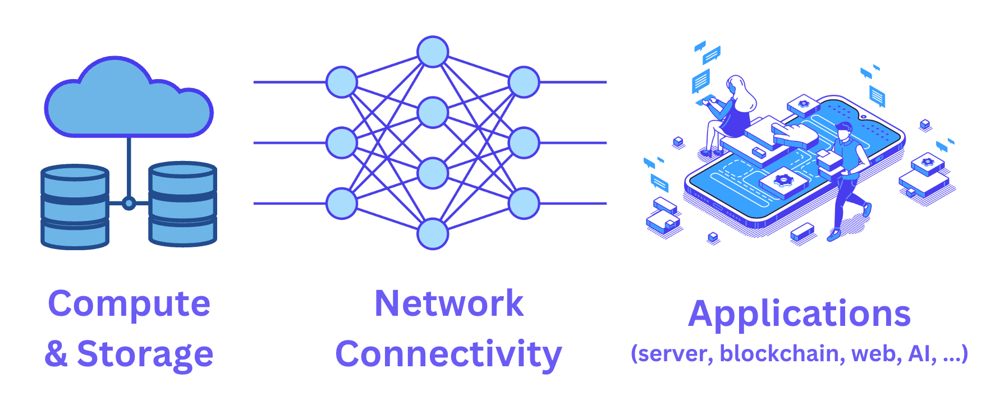
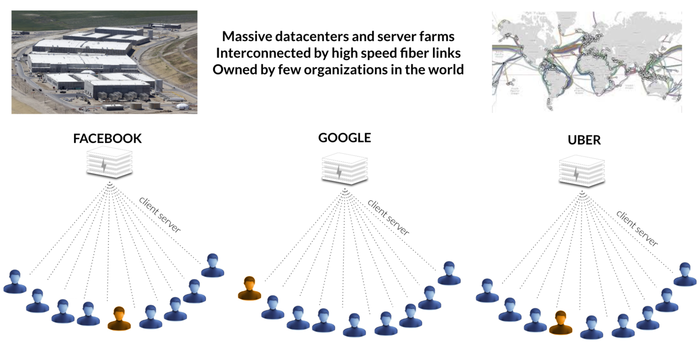

## Concept

The Internet roughly needs 3 layers to function: (1) a network which allows us to communicate, (2) servers providing compute and storage space, and (3) applications delivering the Internet experiences to you.

The current architecture is implemented in a flawed manner, where our digital presence is monetized by large corporations, and the traffic patterns are inefficient (for instance, a Zoom call between two people in Zanzibar might be routed through Europe). Additionally, we are in the midst of a cyber pandemic for which standard clouds don’t have enough defense.

We cannot solve these problems by using the same thinking that created them over the last 30 years. Our tech founders, who are among the original Internet pioneers, have been inventing and creating solutions to overcome the biggest bottlenecks facing the Internet today. Furthermore, this was done, not on the application level, but at the lower infrastructure level.

We welcome the emergence of Web3 and the current decentralized physical infrastructure networks (DePIN) movement; however, it's important to note that many of these projects are still relying on centralized infrastructures, such as Amazon Web Services (AWS), Microsoft Azure and other centralized data centers. For true decentralization to be achieved, projects such as ours are essential.
