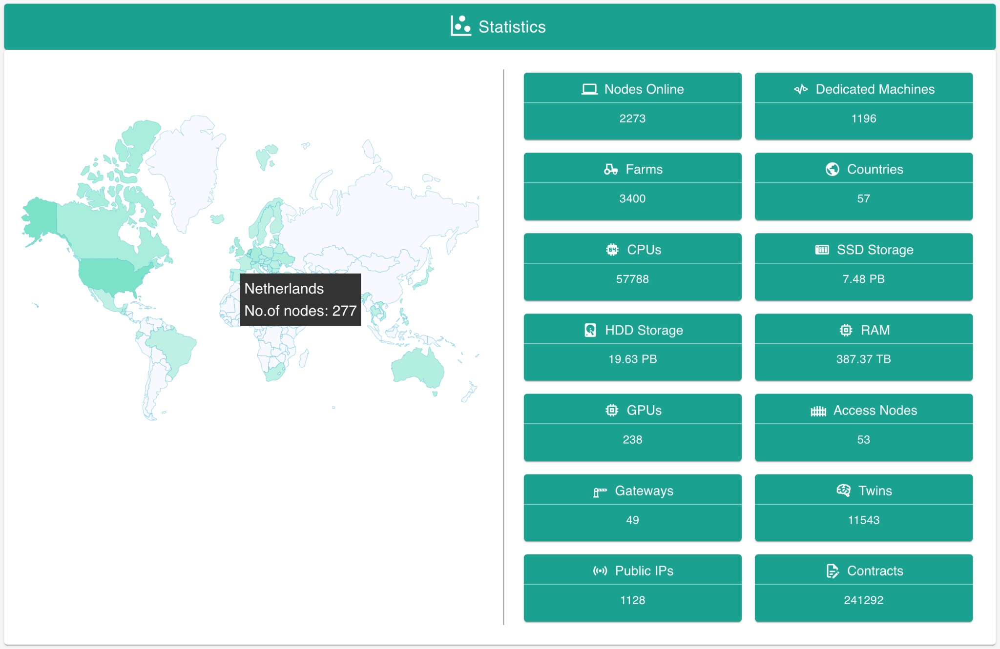

## Let's have fun

> it's a game, let's create our own Internet, viral expansion

Only for true believers, not for the pump and dumpers. Invitation only basis. You need to receive a referral code from a friend before you can access our portal and be part of our phase 2 rollout.

### Node Expansion

* Claim your area on our Global Map and deploy a computer (TFNode) and optionally also offer wireless connectivity (meshed peer-to-peer) to people around you.
* For each active node deployed in a "red zone" who achieves uptime of 99%, you will receive the option to buy a certain amount of TFT at 0.15 USD (our entry price of INCA). This means that, as our token goes up in value, you will have the option to buy TFT cheaper compared to the market price. 
* The first 100,000 nodes as deployed in an "orange or red zone" will receive reward boosters (1.5x)

### User Expansion

* Become part of our viral movement: for each person you bring into the system who shows ownership of at least 10,000 TFT, you will receive the option to buy 2,000 TFT at 0.15 USD (limited to 100m TFT).
* These TFT can be exchanged to INCA, which is our mutual credit currency for the our Grid 
(our new Internet) and the ONLY way to sell/buy services on that network of capacity.

The above shows the current deployed capacity… and this is only the beginning!
