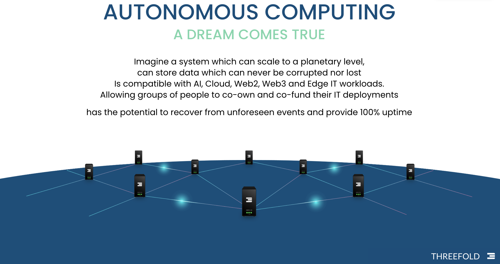
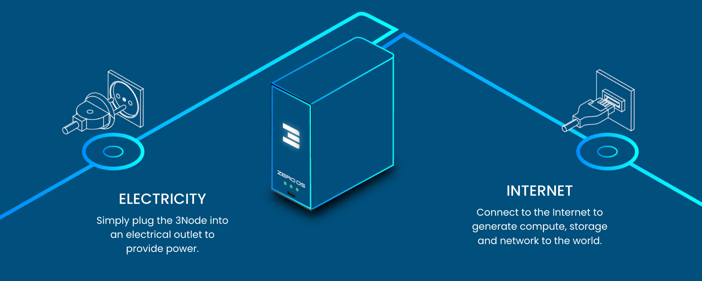

## Our Decentralized Cloud System

Our system comprises several innovative components, with the three main ones being:

* Zero-OS, our open-source low-level operating system, which enables anyone to become a cloud provider. This operating system supports all required Web2 and Web3 workloads.
* Mycelium, our software networking layer (not to be confused by Project Mycelium), which can create networks on both physical and logical levels, fully interconnecting with existing Internet networks. It offers privacy and redundancy that are currently not possible elsewhere. In version 4.0 we will be supporting meshed wireless, lorawan (like helium) and even 5G base stations.
* Our Quantum Safe Storage system, which is capable of storing data in ways that are indestructible, efficient, and ultra-scalable. Previous versions of this system are widely used to store Zetabytes of information by large organizations.

> More info see [Technology](https://info.ourworld.tf/tech/tech/key_innovations_overview.html)