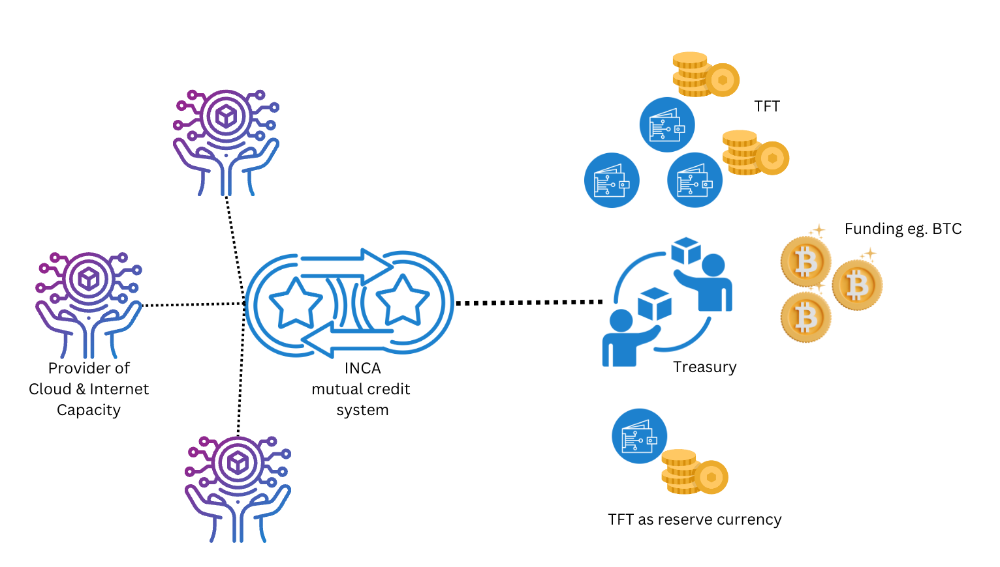

## TFT vs INCA

TFT - our reserved currency, the result of having created our system (1 billion TFT)
- TFT is needed to be able to buy INCA which is needed to buy Cloud and Internet Connectivity.
- TFT is needed to prove reputation for a TFNode.
    - *i.e. to show the community that you have invested in the ecosystem*
- TFT is needed to get a discount.
    - *i.e. the amount of TFT in your wallet defines the discount levels*

For the first year, there is a 1-1 mapping between TFT & INCA, for each INCA in the system there needs to be 1 TFT in the wallet of the user.  The Internet Cloud & Connectivity is +1 trillion USD Business. Our current market cap of TFT is 15m USD.

