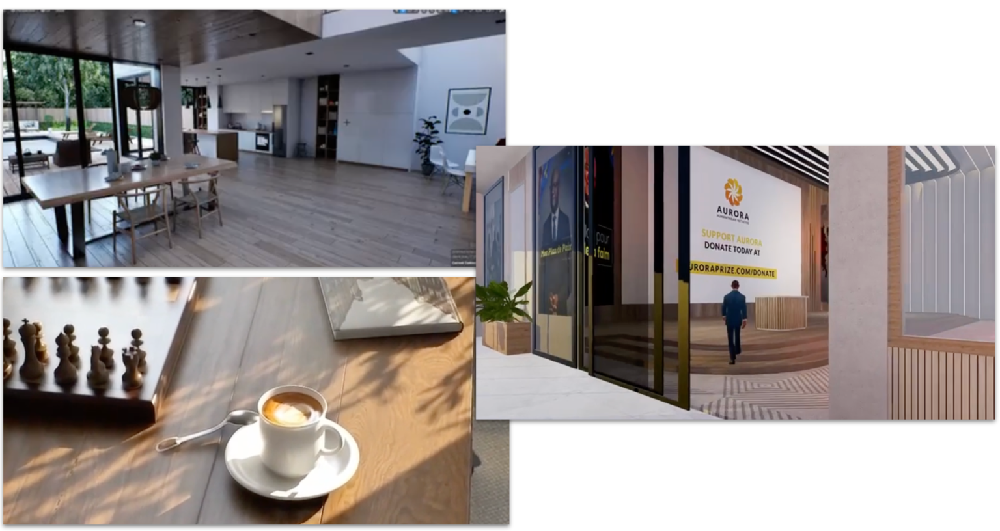

## Upcoming Workloads 

* [https://elest.io/](img/https://elest.io/)

    * Super nice enterprise capable multi cloud front end, +1,000 customers and growing fast.

    * TF will offer elest.io rebranded to some government use cases as well as Elest will promote us.

* https://nodeshift.com/

   *  Virtual Machine management interface, already integrated with ThreeFold

* [https://www.earthwallet.io/](img/https://www.earthwallet.io/) 

    * ThreeFold has been chosen to be the default deployment partner for their Earth nodes as well as Nostr Nodes. All Nodes will use Mycelium and our Quantum Safe Storage system.

    * Earth Wallet is a very exciting project combining social media as well as BTC ultra fast payments.

* [https://www.holochain.org/](img/https://www.holochain.org/) 

    * An incredibly scalable open source P2P app framework system, ThreeFold will endorse their technology as backend for our transaction layer as well as Holochain will be fully supported to run on top of our Grid.

* [A Country Sovereign internet: a game changer to Tanzania](img/https://docs.google.com/document/d/1Zw8hbAfbwm5uST6_zPm2Gr6e_L4tuVj_ecIyR_uCkN0/edit#heading=h.l3mcviioimzi)

    * Tanzania and Zanzibar want to roll out a sovereign Internet based on ThreeFold

* [VVerse = probably one of the most capable metaverse technologies ever made](img/https://www.vverse.co/)

    * The ThreeFold grid will host the GPU’s and can be used to render in the cloud and use low latency connection to stream virtual reality environments which have video-like quality.

    * A lot of storage & GPU capacity is required for the further roll out of this metaverse.

    * This metaverse will natively support INCA and allow people to earn INCA by expanding the virtual world.

* Many more to be announced … 

*These pictures show the realistic output as can be rendered from VVerse on top of ThreeFold*

There are many more use cases coming, any of the above mentioned use cases can eat all capacity of our current ThreeFold grid, expansion is needed to support the needs of our upcoming ecosystem.

