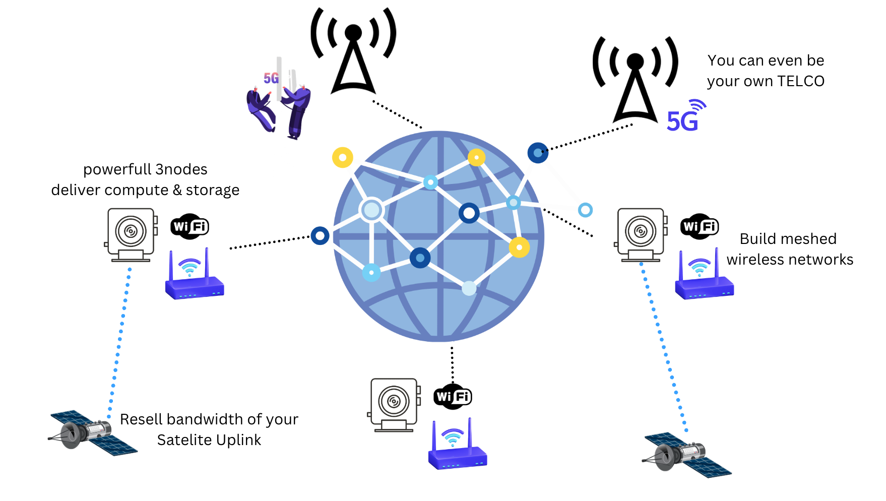

## We have all the tech required to build an Internet from scratch if that would be needed

Companies or individuals can invest in computers, ThreeFold wireless routers, or even 5G mobile antennas to provide Internet and Cloud Services to those around them. Our innovation lies in simplifying something incredibly complex, making it accessible and deployable by everyone. We have developed technology that enables anyone to become a Cloud and Internet service provider by creating an autonomous system capable of self-management without the need for human intervention.

Everyone can now:

* Be a Cloud Provider and deliver compute, storage and AI capabilities to people around you.
* Be a Wifi Provider and deliver reliable communication almost for free.
* Buy Internet connectivity and resell this connectivity to the people around you.
* Be a Telecom Operator and deliver 4/5G Telecommunication Services (end of 2024)

The results are astonishing:

* The cost of providing such infrastructure can be less than $2 USD per person per month for storage, compute, and network (telecom) services, which is significantly lower than current rates. This system has the potential to connect the 4 billion people who are currently offline, allowing anyone to earn money by providing these services without needing to be a tech expert.
* More than 90% of all data can be localized, reducing bandwidth requirements to the rest of the Internet by 90%. By acting as a content delivery network (CDN), you help save on bandwidth costs for everyone, while also enhancing performance.
* This platform enables new use cases, such as streaming virtual and augmented reality directly from the cloud to your mobile phone, offering ultra-realistic video quality without the need for expensive equipment.
* The system is designed to withstand war or natural disasters: as long as there are enough nodes and the Mycelium network is operational, it can continue providing connectivity at any time.
* Our data and applications are truly sovereign, allowing us to choose where our digital life resides. This could fundamentally change how the Internet works.
