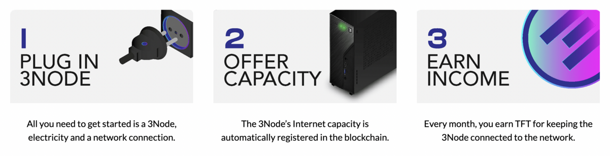
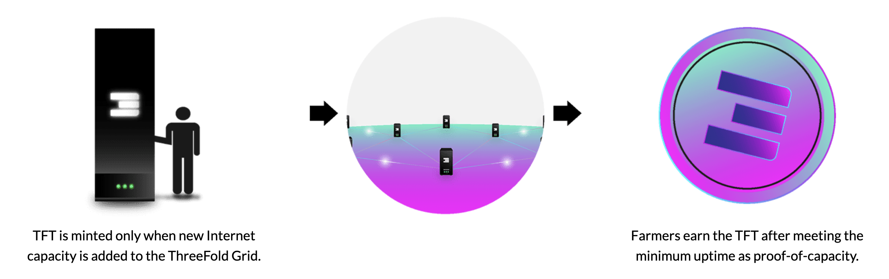

## Host a node

You can help make Tanzania’s own sovereign internet a reality by hosting a node.

By connecting hardware at your home or office – or anywhere you’d like – you provide Internet capacity for the people around you and earn a new digital currency, TFT.

### How to build a node

**Step 1 -** Obtain the hardware for a node which can be purchased [here](https://marketplace.3node.global/index.php)

**Step 2 -** Follow this [instruction manual](https://manual.grid.tf/farmers/3node_building/3node_building.html) to set up your node

**Step 3 -** Earn TFT [(learn more)](https://manual.grid.tf/farmers/farming_optimization/farming_optimization.html)

We have a team on the ground in Dar Es Salaam for all the necessary support that you might need with setting up your node.

### How to earn TFT

Farmers earn TFT according to the amount of Internet capacity their Nodes connect to the ThreeFold Grid. The Internet capacity is verified by the ThreeFold Blockchain on an ongoing basis using the “Proof-of-Capacity” algorithm. Learn more [here](https://manual.grid.tf/threefold_token/threefold_token.html).

