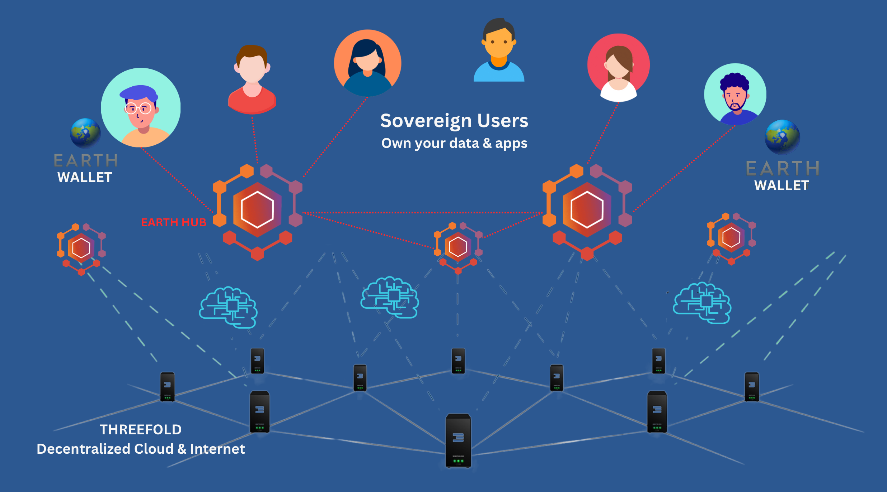

# Earth Hub

Earthhub is a novel way how to re-invent how the social networks work based on existing protocols and apps.

There are very good protocols out there like 

- matrix
- activitypub
- nostr

Each have their own speciality and the app support by now is marvelous.

> more than 280,000,000 users are now on decentralized platforms based on the 3 above chosen protocols.

## There are still some elements slowing it down:

- no monetization of the hosters of the servers
- complexity to install, maintain a server
- different protocols, not being interlinked (need more bridges)
- hard to find users and define your interest groups
- redundancy: how do we know my data is safe?

## How do we resolve these issues

### Monetization

- Thanks to EarthWallet micropayments are done to automatically reward the relays, nodes, bandwidth points for utilization.
- Cost: having full blown sovereign social network app capabilities doesn't have to be expensive, a couple of USD per month should be enough. There is not something as a free lunch.
- Customers will not feel it, they will only pay for what they use which will be super small.

### Complexity

EarthHub adds the following:

- Single Sign On
- Unified Naming System
- No need to maintain/install nodes.
- Mycelium as network interconnects all nodes over all protocols and provides an ultra safe connectivity for all.
- All is done with full self healing capabilities.

### Find Users (user experience)

- at each Hub we do single sign on and make it super easy for people to find each other.

### Redundancy

- thanks to EarthHub all data is stored on a storage system (quantum safe) which makes sure data can never be corrupted nor lost.

## What extra will we add

- personal e-book + website publishing platform with support for CDN in Mycelium
- personal S3 server which serves as backend for all above (also the  backup of your social media exposure)