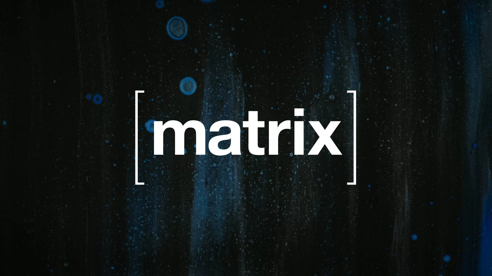

# Utilization

> more than 280,000,000 users are now on decentralized platforms based on the 3 chosen protocols.

### ActivityPub: +150,000,000

- **Overview**: ActivityPub is a decentralized social networking protocol that powers a wide range of social media platforms and applications, the most notable being Mastodon. It enables users across different platforms to interact with each other.
- **User Count**: Mastodon, the largest platform using ActivityPub, +14.4 million, spurred by a significant influx of new users around that time. The total number of ActivityPub users across all platforms is way higher when including other services like Pleroma, PeerTube, and Pixelfed, Threats (meta)

### Matrix: +115,000,000

- **Overview**: Matrix is an open network for secure, decentralized communication, supporting instant messaging, VoIP, and video calling features. It's used by a variety of clients and services, both for personal messaging and organizational communication.
- **User Count**: As of early 2023, Matrix had over 60 million addressable users. This number represents the total users that can be reached within the Matrix network, though active user numbers may be lower. The growth of Matrix has been consistent, driven by both community adoption and organizational use, including several governmental bodies. Today its more than 115,000,000 users.

### NOSTR

- **Overview**: NOSTR (Notes and Other Stuff Transmitted by Relays) is a relatively new and simple decentralized protocol for open and censorship-resistant social networks. Being in its early stages, it has attracted attention for its simplicity and potential for privacy-focused social networking.
- **User Count**: +-400k but hard to know exact. Adoption is currently much lower than for ActivityPub or Matrix, but interest in the protocol is growing within certain communities focused on privacy and decentralization.

### Remarks

- **Growth and Adoption**: While ActivityPub has seen widespread adoption due to platforms like Mastodon, Matrix is also significantly growing, particularly among tech-savvy users and organizations needing secure communication. NOSTR, being newer, has a smaller user base but is of interest to those deeply invested in decentralization and privacy.
- **Measurement Challenges**: Measuring the exact number of users on decentralized networks is inherently challenging. Many instances or servers do not publicly report their user numbers, and users can have multiple accounts across different servers.

## conclusion

While ActivityPub currently leads in terms of user adoption mainly because of Mastodon's popularity, Matrix is also a significant player in the decentralized communication space with a strong user base. NOSTR is an emerging protocol with potential for growth as it gains more recognition and development support.