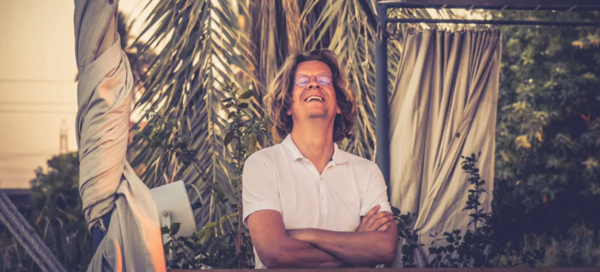

*Kristof on one of his favorite spots, The Nile in Egypt*

# Kristof: GEK = “Chief Executive Geek“

We dream about a world where everyone can be happy, with respect for each other and the world’s resources. A world where we dare to love ourselves and we don’t have to be scared about our future. A world where we don’t need to be a product and we have learned to collaborate with openness and trust.

We believe we are born as beautiful people, but fear leads us in a direction that might not be the path to happiness. In general, we believe that people want to do good.

Our personal passion is to develop tools which help with:

 
 
 

*If anyone is looking for my [official business profile](https://threefold.docsend.com/view/kipdw3c7fvf2r35s), you can find it here.*
