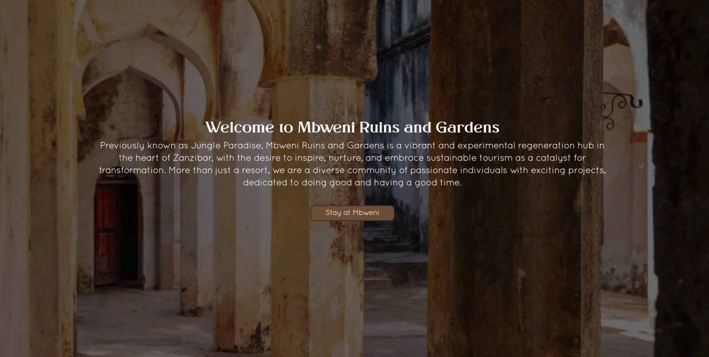
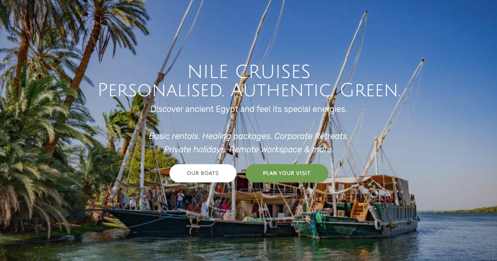

## Mbweni Ruins

We are honored that we were given an incredible location in Zanzibar, this location is so unique and we are looking forward to make this a co-owned space, our dream is that thousands of people can own this gift from "Eden"

The space is unique because of

- botanical guarden created in 18e century by [Sir John Kirk](https://en.wikipedia.org/wiki/John_Kirk_(explorer)#:~:text=Sir%20John%20Kirk%20GCMG%2C%20KCB,his%20political%20assistant%2C%20Ali%20bin) and David Livingstone
- historical ruins which was a school and missionary to end slavery in Zanzibar
- biggest mangrove Forest in Zanzibar which needs protection
- an incredibly beautiful beach still close to Stonetown
- the new HQ for OurWorld Zanzibar to build the digital freezone and a new Internet

Come and visit us to build a new future.

> see [https://www.mbweniruinsandgardens.com](https://www.mbweniruinsandgardens.com)

## Veda Dahabiyas on the Nile 

Over four years ago, we embarked on a journey of organizing cruises along the Nile. Veda Egypt operates four boats, we offer a unique opportunity to explore the energy of the Nile and its temples in an unparalleled manner.

[See a CNN documentary made couple of years ago.](https://player.vimeo.com/video/371621672)

We have been so lucky and grateful to experience wonderful moments on the Nile. 

> more info see [https://www.veda-egypt.com](https://www.veda-egypt.com/)

There is a plan to make the boats co-owned by means of digital shares (digital assets) which would regulated in our digital freezone. This way many more projects can call these boats their own home and invite their own guests.

