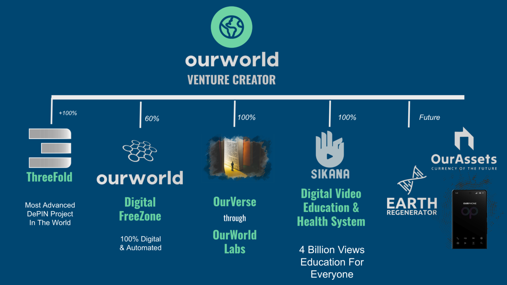
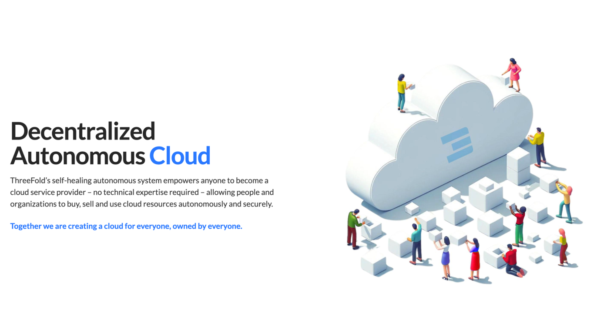
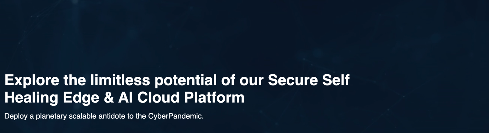

## OurWorld Venture Creator

Kristof is the founder and CEO of OurWorld Holding in Mauritius.

This venture creator has a novel approach how to use technology to do good.

We believe high tech can do incredible things if used properly.

> [more information in slides](https://threefold.docsend.com/view/3akkxddb7vutwrsx/d/xxq44minwftv2rgg)

We are fundraising In OurWorld as a SAFE investment instrument.

We are very excited about our tech projects

- a global decentralized cloud
- a digital freezone, which can be a real "afe haven" for millions of people
- an education system which has already proven its value

We are working on some super cool additional projects

[Kristofs Official Profile](https://threefold.docsend.com/view/kipdw3c7fvf2r35s)

## ThreeFold Decentralized Cloud 

Founded by Internet 1.0 Pioneers

About a decade ago, a group of passionate Internet & cloud veterans came together to build a system which can grow to a scalable, safe, compatible, and co-owned IT infrastructure.

Today the TFGrid is on +50 countries and will launch soon on Solana, **[see this site for more condidential info](https://friends.threefold.info/solana/)**.

> [see ThreeFold Website](https://threefold.io/)

Threefold is 100% owned by our venture creator: OurWorld

## TF9 our Belgium Tech company

Kristof is the founder and CEO of TF9 In Belgium.

TF9 owns the IP (Intellectual Preperty) as has been used to create the ThreeFold Cloud.

TF9 works with governments and large organizations to deliver 2 main usecases

1. antidote to the Cyber Pandemic
2. [Tier S datacenter](https://info.ourworld.tf/datacenter) as a better way how deploy lots of AI, Internet & Cloud capacity fast.

> [See TF9 Website: https://tf9.io](https://tf9.io/)

TF9 is 100% owned by our venture creator: OurWorld