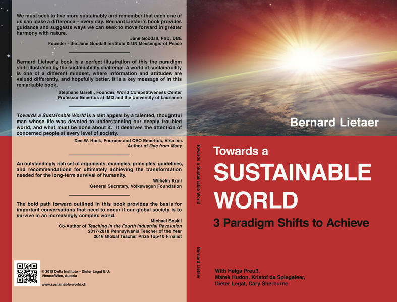

[more info](https://bsahely.com/2020/02/29/towards-a-sustainable-world-bernard-lietaer-delta-institute-dieter-legat)

We had the honor to co-author this book which we are very proud off.

We honestly believe that the teachings of Bernard are a fundamental tool towards a better world.

Its a small book with a lot of content, if you want to have a copy let us know.

We are working on a project which will probably be called "project mycelium" which is all about delivering a digital backbone (built on top of ThreeFold tech) in line with the paradigm shifts as described in this book.

[Download the PDF](towards_a_sustainable_world.pdf)

or [this link](https://bsahely.com/2020/02/29/towards-a-sustainable-world-bernard-lietaer-delta-institute-dieter-legat/)