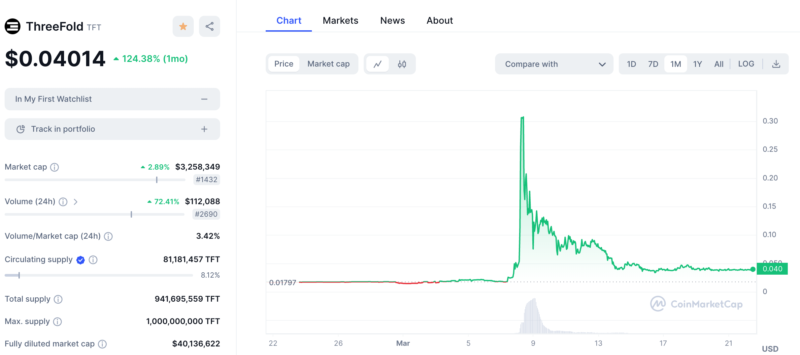

# ThreeFold is launching on Solana.

Last week someone decided to pump & dump our token, the crazy thing is 39m USD was going around within 24h (note we don't deploy any marketmakers).

We can see that they are still buying tokens at cheap price, thats why they did a dump which might point to a next pump.

see [https://coinmarketcap.com/currencies/threefold/](https://coinmarketcap.com/currencies/threefold/)

*Please note not all info on coinmarketcap is right e.g. the circulating supply is I think higher.*

The previous time we weren't ready, this time we want to be.

This is why we decided to launch ThreeFold on Solana with a new Token which is compatible with the previous token called TFT.

We are reaching out to our community to organize this step and for now the launch date is planned for March 11 2024.

Each TFT holder will be able to buy 3.2 INCA for 1 TFT, INCA will be the new token. INCA stands for INternet CApacity.

**[see this site for more condidential info about our Launch](https://friends.threefold.info/solana/)**, we are looking for more feedback and contributors.

 
 
 
 

> The information shared on this page is solely personal, shared between friends. I do not recommend investing in any of our projects based on information as shared on this page.