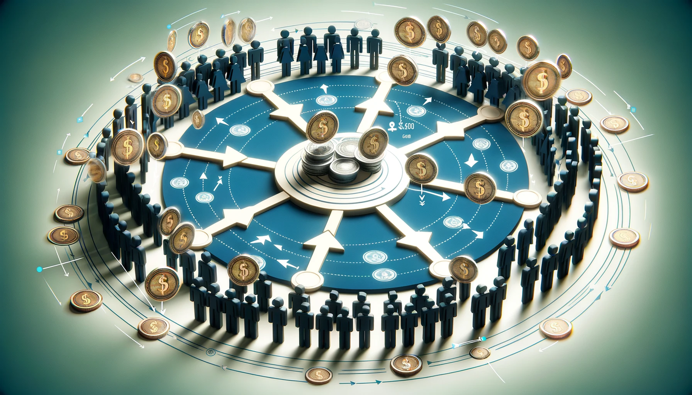

> [a very good arcticle how mutual credit system works and where it came from](https://blog.holochain.org/mutual-credit-part-1-a-new-type-of-cryptocurrency-as-old-as-civilisation/)

## What is Mutual Credit

Mutual credit is a form of money in which users pay each other using a system of debits and credits. Within such a payment system, there is no need for cash or banks. 

Mutual credit can help revive organic trade between neighborhood businesses or among community members. 

It is stimulative in a way that reflects community values. That's because transactions (technically lending and borrowing) are guided not only by profit but by participants long-term priorities as community members and the trust they have in each other.

## More details (Arthur Brock and Eric Harris-Braun)

In a mutual credit system, units of currency are issued when a participant extends credit to another user in a standard spending transaction. Picture a new mutual credit currency with all accounts having a zero balance. The first transaction could look like this: Alice pays Bob 20 credits for a haircut. Alice's account now has -20, and Bob's has +20.

Notice the net number units in the system remains zero, just like the balance sheet in standard accounting must always balance to zero. That accounting practice places no limits on the amount of cash or assets a business can have; it simply means they are offset by an equal amount of liabilities or equity. Every negative balance in a mutual credit system is offset by positive balances so there is always a systemwide ZERO balance. You could think of the total number of units in circulation at any time as the sum of all the negative balances (or, if you prefer, the sum of positive balances since they are the same number).

But wait — Alice spent credits she didn't have! True. That's exactly how issuance in mutual credit works. Managing the currency supply in a mutual credit system is about managing credit limits — how far people can spend into a negative balance. Different systems set different rules about this, ranging from everyone having the same limit (e.g. 100 credits), to having NO limits and leaving the choice up to each person as to whether they want to extend more credit to someone deep in debt. It really depends on the community, the relationships, and the use case.

One elegant approach to managing mutual credit limits is to set them based on actual demand. You can calculate credit limits to be an equivalent of what you can pay back in 3 months (or another arbitrary period) based on the transaction history of each account (with a couple of anti-gaming modifications). This allows the currency supply to expand and contract based on the actual usage patterns of the community which demonstrate the market demand for the value people are providing." (http://ceptr.org/whitepapers/mutual-credit)

### Some references

- [https://ceptr.org/whitepapers/mutual-credit](https://ceptr.org/whitepapers/mutual-credit)
- [https://wiki.p2pfoundation.net/Mutual_Credit](https://wiki.p2pfoundation.net/Mutual_Credit)
- [https://doughnuteconomics.org/tools/94](https://doughnuteconomics.org/tools/94)

