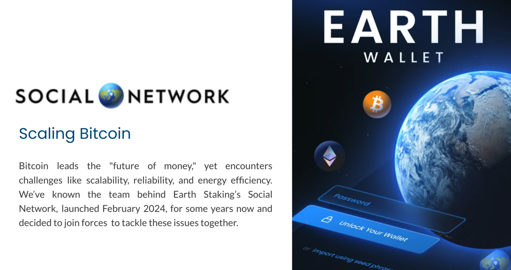
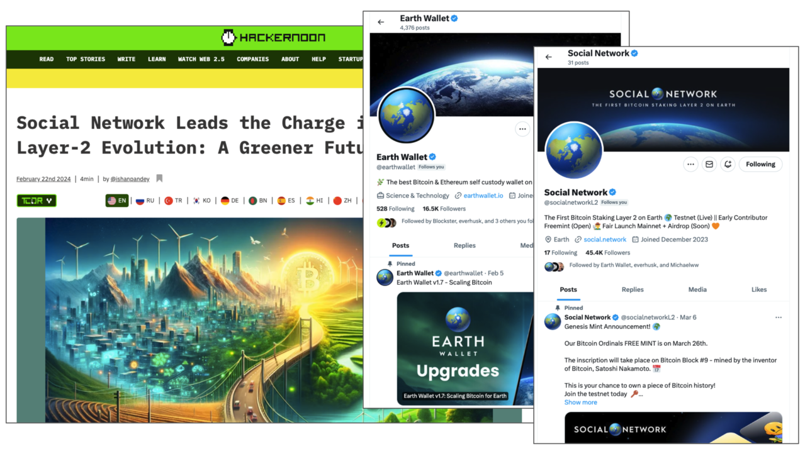

## Earth Wallet

**Introduction:**
[Earth Wallet](https://www.earthwallet.io/) is a cutting-edge digital wallet solution designed to empower users with secure, decentralized control over their digital assets. With a focus on accessibility, security, and sustainability, Earth Wallet offers a seamless and user-friendly interface for managing various cryptocurrencies and digital tokens.

**Partnership with ThreeFold:**
Earth Wallet and ThreeFol's future strategic partnership would leverage the transformative potential of ThreeFold's TF Grid technology in enhancing the functionality, security, and sustainability of Earth Wallet's services.

**Utilization of TF Grid:**
1. **Decentralized Hosting:** Earth Wallet wills utilize TF Grid's decentralized hosting infrastructure to ensure the highest levels of security and availability for its users' digital assets. By leveraging ThreeFold's grid of autonomous and decentralized nodes, Earth Wallet can offer a robust hosting environment that is resistant to traditional centralized points of failure.
   
2. **Scalability and Capacity:** Through the utilization of TF Grid, Earth Wallet will gain access to a scalable and distributed network infrastructure capable of handling varying levels of demand and workload. This ensures that Earth Wallet users experience uninterrupted access to their digital assets, even during periods of high traffic or increased activity.
   
3. **Sustainability:** By partnering with ThreeFold and utilizing TF Grid, Earth Wallet would demosnstrate a commitment to sustainability and environmental responsibility. TF Grid's decentralized architecture reduces the energy consumption associated with traditional data centers, contributing to a more sustainable future for digital infrastructure.

The partnership between Earth Wallet and ThreeFold represents a convergence of cutting-edge technology and a commitment to user empowerment, security, and sustainability. By harnessing the capabilities of TF Grid, Earth Wallet provides users with a secure, scalable, and sustainable digital wallet solution, ensuring that their digital assets are always within reach, while also contributing to the advancement of decentralized technology and environmental stewardship.
