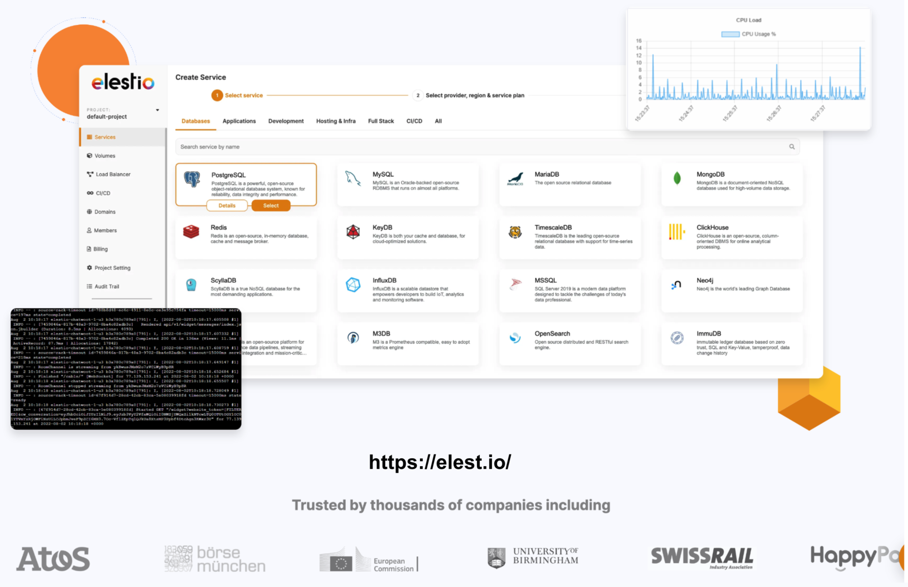

## Elestio

**Introduction:**
[Elestio](https://www.elestio.com/) is an innovative platform dedicated to providing cutting-edge decentralized applications (dApps) and services to users worldwide. With a focus on accessibility, security, and user empowerment, Elestio aims to revolutionize the way individuals interact with decentralized technologies.

**Soon: Apps Hosted on the Grid:**
 ThreeFold's TF Grid is able to host a diverse range of decentralized applications. These applications span various categories, including finance, social networking, gaming, and more. By hosting Elestio on the TF Grid, we would provide a high availability, security, and scalability for Elestio's users, offering a seamless and reliable experience across all its offerings.

**Benefits for Users:**
1. **Enhanced Security:** With Elestio's applications hosted on the TF Grid, users can enjoy enhanced security and data privacy. The decentralized nature of the grid minimizes the risk of single points of failure and unauthorized access, ensuring that users have full control over their data and transactions.

2. **Seamless Accessibility:** Elestio's partnership with ThreeFold ensures seamless accessibility to its decentralized applications. Users can access Elestio's services from anywhere in the world, without being restricted by geographical boundaries or infrastructure limitations.

3. **Scalability and Performance:** By leveraging the TF Grid's scalable infrastructure, Elestio can effortlessly accommodate growing user demands and ensure optimal performance for its applications. Whether it's handling a surge in user activity or scaling up resources for new features, Elestio's users can expect a consistently smooth and responsive experience.

**Soon:**
In the near future, users will have the opportunity to host Elestio applications on the TF Grid. This upcoming feature will empower individuals to contribute to the decentralized ecosystem by hosting and participating in the Elestio network, further enhancing the platform's resilience, decentralization, and accessibility.