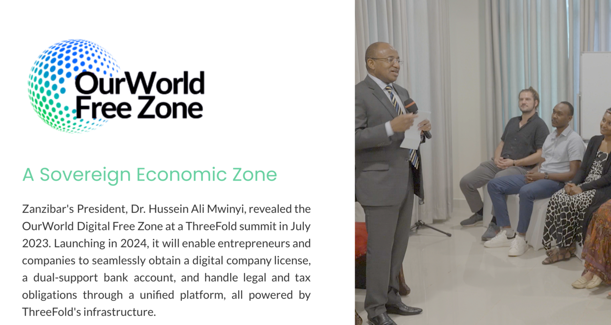
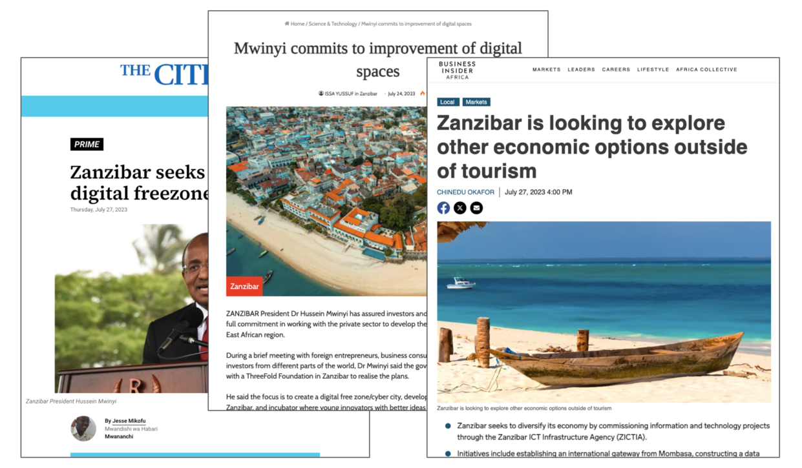

## OurWorld Digital FreeZone (Zanzibar)

**Introduction:**
The OurWorld Digital FreeZone, established in Zanzibar, is a groundbreaking partnership between ThreeFold and the government of Tanzania. This initiative aims to create a free sovereign digital and economic area, fostering innovation, growth, and prosperity within the region.

**Purpose:**
The OurWorld Digital FreeZone serves as a catalyst for economic development and technological advancement in Zanzibar and beyond. By providing a conducive environment for digital ventures to thrive, the FreeZone aims to:

- Stimulate Economic Growth: By attracting digital businesses and fostering entrepreneurship, the FreeZone contributes to the expansion of Zanzibar's economy and the creation of employment opportunities.
- Promote Innovation: Through collaboration and knowledge exchange, the FreeZone encourages the development of innovative solutions and technologies that address local and global challenges.
- Empower Entrepreneurs: By offering affordable company licenses and streamlined processes, the FreeZone empowers entrepreneurs to pursue their business ideas and transform them into successful ventures.

**Audience:**
The OurWorld Digital FreeZone is designed to cater to a diverse audience, including:

- Entrepreneurs: Individuals with innovative ideas seeking a supportive environment to launch and grow their digital ventures.
- Tech Startups: Early-stage companies looking for resources and opportunities to accelerate their growth and scale their operations.
- Investors: Venture capitalists and angel investors interested in supporting promising startups and contributing to the development of the digital ecosystem.
- Government Agencies: Authorities responsible for economic development and regulatory oversight, collaborating to create an enabling environment for digital innovation and investment.

**Key Features:**
1. **Automated Onboarding Process:** OurWorld Digital FreeZone offers an automated onboarding process that ensures compliance with Know Your Customer (KYC) and Anti-Money Laundering (AML) regulations, streamlining the setup of digital ventures with ease and efficiency.

2. **Banking & Web3 Compatibility:** Seamlessly manage both fiat and digital currencies with comprehensive banking solutions compatible with Web3 technologies, facilitating frictionless transactions and financial operations.

3. **Built-in Legal & Tax Settlement:** Experience hassle-free business operations with built-in legal and tax settlement services, simplifying legal obligations and ensuring compliance with regulatory requirements.

4. **Affordable & Flexible Company Licenses:** OurWorld Free Zone offers cost-effective and flexible company licenses, providing entrepreneurs with affordable options to kickstart their entrepreneurial journey and establish their ventures within the FreeZone.

5. **Sovereign Economic Jurisdiction:** Empowering businesses to operate within an independent economic environment, the OurWorld FreeZone fosters growth and prosperity by offering businesses the freedom to innovate and grow without traditional regulatory constraints.

6. **Powered by Data Sovereign Tech:** Your privacy, data, and security are paramount. OurWorld Digital FreeZone utilizes Quantum Safe Storage technology to safeguard digital information, ensuring data sovereignty and protection against cyber threats.

**Conclusion:**
The OurWorld Digital FreeZone in Zanzibar represents a transformative partnership between ThreeFold and the government of Tanzania, aimed at creating a dynamic and innovative ecosystem for digital ventures. By providing a sovereign economic jurisdiction and a range of supportive services, the FreeZone empowers entrepreneurs and businesses to thrive, driving economic growth and prosperity within the region.

For more information, visit [OurWorld Digital FreeZone](https://freezone.ourworld.tf/).
