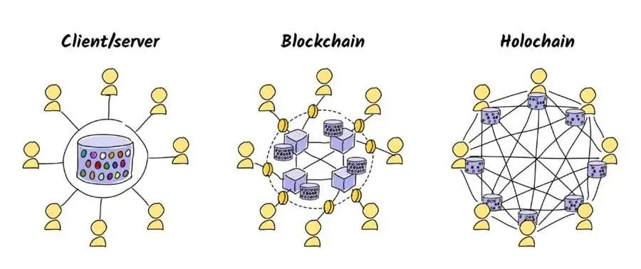

## ThreeFold + Holochain

> TODO: cleanup, douple text

Holochain is a more peer2peer alternative to the blockchain, giving developers a framework for creating decentralized applications (dApps).

One huge change to enable this is a switch from the data dependent blockchain to an agent-centric system. Holochain’s method avoids keeping a global consensus, using an agent system in which each agent keeping a private fork, and that is stored and managed in a limited manner on the blockchain with a distributed hash table.

This avoids scalability problems that have plagued blockchain solutions. It also allows any dApps hosted on Holochain to do far more with less resource than required for blockchains. In this Holochain review, we will take an in-depth look at the project, technology and token prospects.

Holochain is a framework for creating and powering distributed applications, incorporating peer-to-peer content distribution protocol, cryptography, and hash tables. It avoids scalability issues, and is extremely environmentally friendly.

Above info came from [https://www.coinbureau.com/review/holochain-rsm/](https://www.coinbureau.com/review/holochain-rsm/)

ThreeFold and Holochain will together go to market, Holochain as application layer being hosted on the ThreeFold Grid.

### *Introduction to Holochain:
[Holochain](https://www.holochain.org/) is a framework for building decentralized applications (dApps) that is designed to be scalable, efficient, and adaptable. Unlike traditional blockchain architectures, Holochain uses a distributed hash table (DHT) to enable peer-to-peer communication and data storage, offering greater flexibility and performance for decentralized applications.

## Partnership with ThreeFold:
The partnership between ThreeFold and Holochain represents a convergence of decentralized infrastructure and application development frameworks. By leveraging the strengths of both platforms, the partnership aims to foster innovation and accelerate the adoption of decentralized technologies.

### How the Partnership Works

**Integration of Services:** ThreeFold's TF Grid will integrate with Holochain's framework, providing decentralized hosting and storage solutions for Holochain-based applications. This integration will enable developers to deploy their dApps on a scalable and resilient infrastructure, enhancing performance and reliability for end-users.

**Benefits for Users:**
- **Enhanced Performance:** Users of Holochain-based applications hosted on the TF Grid will experience improved performance and responsiveness, thanks to the scalable and distributed nature of ThreeFold's infrastructure.
- **Increased Reliability:** By leveraging ThreeFold's decentralized hosting solutions, users will benefit from enhanced reliability and uptime for Holochain applications, reducing the risk of downtime and service interruptions.
- **Data Sovereignty:** Users will have greater control over their data and digital assets, as Holochain applications hosted on the TF Grid will adhere to principles of data sovereignty and privacy.

**Conclusion:**
The partnership between ThreeFold and Holochain represents a strategic alignment of decentralized infrastructure and application development frameworks, aimed at empowering developers and users to build and deploy scalable, efficient, and resilient decentralized applications. By leveraging each other's strengths and capabilities, the partnership holds the promise of driving innovation and accelerating the adoption of decentralized technologies across various industries and use cases.

For more information about Holochain, visit [holochain.org](https://www.holochain.org/).

