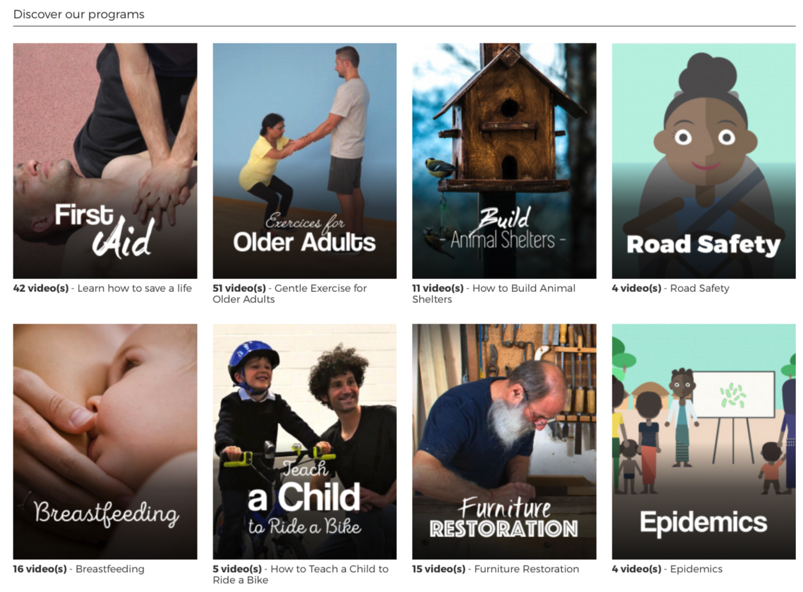

# Sikana: Education for All

[Sikana](https://www.sikana.tv/), a platform dedicated to providing education for all, has delivered over 400 million lessons through free educational videos. However, the platform has faced financial challenges in hosting its content at scale. In collaboration with ThreeFold, Sikana aims to overcome these challenges and further its mission of providing accessible education by creating local content in native languages and hosting it on local infrastructure. This partnership will empower communities worldwide with knowledge and skills, irrespective of their financial or geographical limitations.

- Over 2,000 educational videos available.
- Over 2 billion views on the platform.

**Why:**
The collaboration between Sikana and ThreeFold is driven by a shared vision of democratizing access to education. By hosting educational content on local infrastructure and creating content in native languages, Sikana aims to break down barriers to education and empower individuals and communities to learn and grow.

**How ThreeFold Can Support Sikana:**
ThreeFold can support Sikana by providing decentralized hosting solutions for its educational content. By leveraging ThreeFold's decentralized cloud computing platform, Sikana can significantly reduce its hosting costs while ensuring scalability, reliability, and data sovereignty. This partnership will enable Sikana to continue expanding its educational offerings and reach even more learners worldwide.

This collaboration between Sikana and ThreeFold represents a powerful synergy between education and technology, driving positive change and empowerment on a global scale.

Visit [Sikana](https://www.sikana.tv/) for more information.

