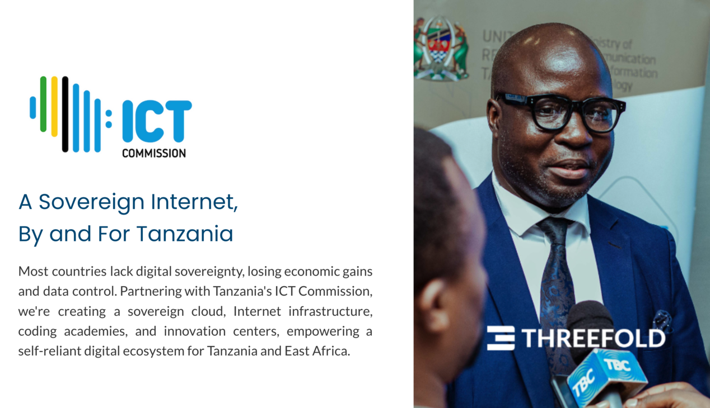
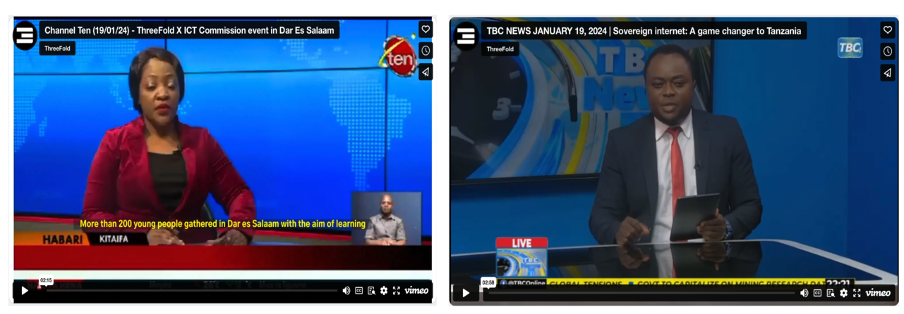

## Tanzania Sovereign Internet Partnership with ThreeFold

ThreeFold is proud to announce its partnership with the government of Tanzania to establish a sovereign internet, a groundbreaking initiative poised to revolutionize Tanzania's startup ecosystem. Through this collaboration, ThreeFold aims to empower Tanzania with decentralized internet infrastructure, reducing reliance on internationally controlled internet services and fostering digital sovereignty.

**What is the Partnership About?**
The partnership between ThreeFold and Tanzania revolves around the establishment of a sovereign internet infrastructure. This initiative is part of the 'Dunia Yetu' program, which aims to incubate and support digital projects in Tanzania. Through Dunia Yetu, local innovators will receive support such as IT mentorship and access to decentralized hosting solutions provided by ThreeFold. This collaboration creates a peer-to-peer platform that empowers local entrepreneurs and startups to develop and host their products and services on local servers.

**How Does ThreeFold Support?**
ThreeFold's decentralized cloud aims to support Tanzania's sovereign internet architecture. By leveraging ThreeFold's technology, Tanzania can establish a robust and secure internet infrastructure that is resilient to external control and censorship. Through the 'Dunia Yetu' program, local innovators can access decentralized hosting solutions offered by ThreeFold, reducing costs and improving data sovereignty. Additionally, ThreeFold provides IT mentorship and support to ensure the success of digital projects incubated under the program.

**Why is it Important?**
The establishment of a sovereign internet in Tanzania holds significant economic and strategic importance. By reducing reliance on international internet services, Tanzania can save billions of dollars annually and protect its foreign reserves. Moreover, fostering local innovation

- [Watch here 1](https://vimeo.com/920060589/d033b79295?share=copy): TEN
- [Watch here 1](https://vimeo.com/919967495/340e62170b?share=copy): TBC
