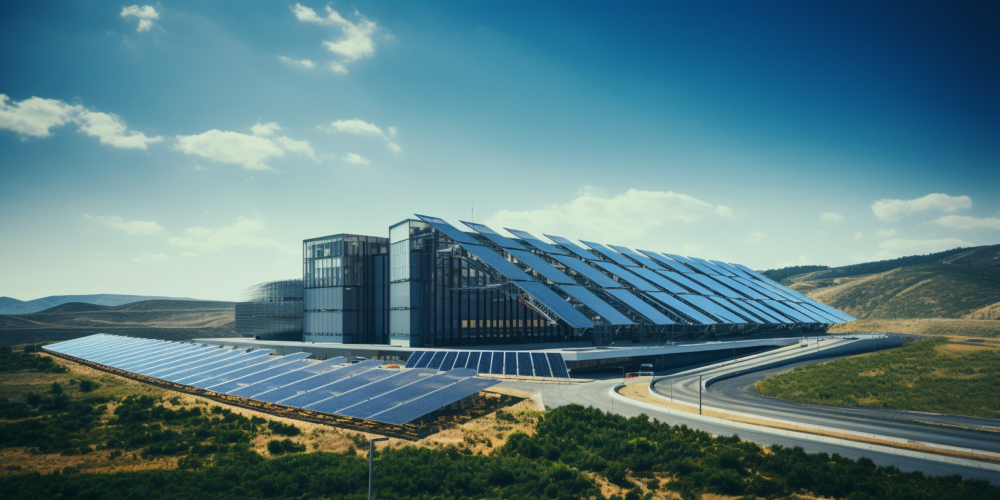
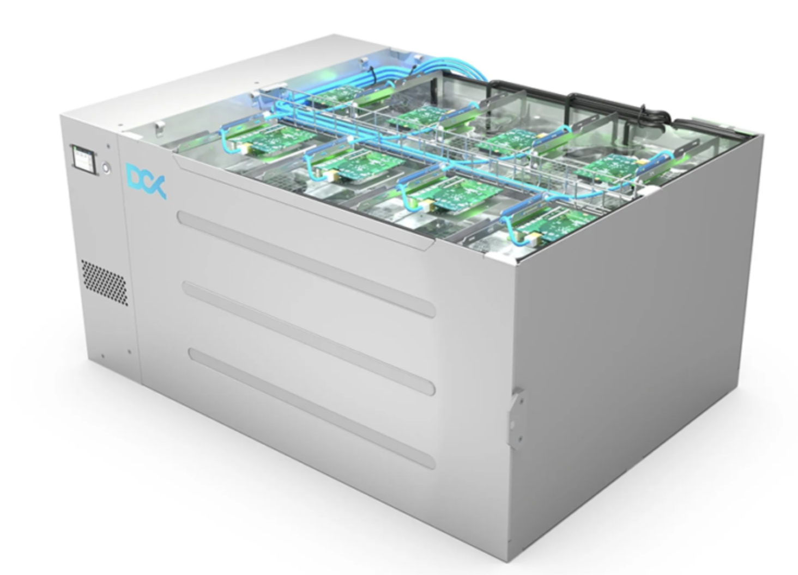
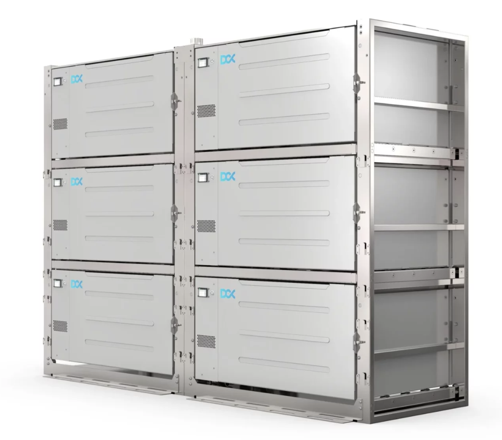
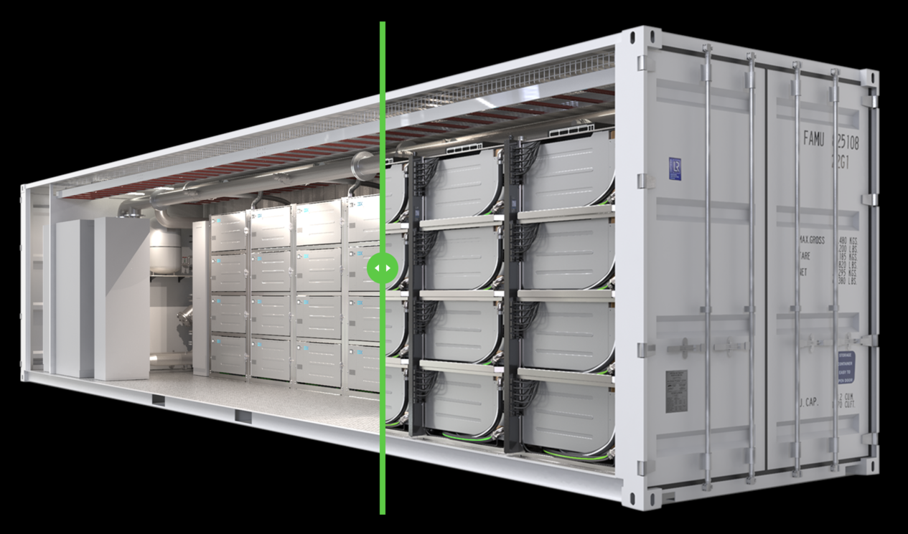

# Tier S Datacenter Concept

Most governments or large companies still build following Tier-3 Datacenter concept, but this concept is no longer viable because of the way how AI changed everything.

> More information can be found in [https://info.ourworld.tf/datacenter](https://info.ourworld.tf/datacenter)

ThreeFold works with partners to use the TFGrid software to deploy massive amounts of capacity.

We expect a lot of our capacity to be fully decentralized to smaller owners (farmers) but we also expect countries or large enterprise to deploy large capacity pod's.

The market ThreeFold operates in is +1 trillion USD market.

These pods are being aggregated in racks per 6

These racks are used as is or put in a container.

These containers can be used in a datacenter building to make it all fancy.
