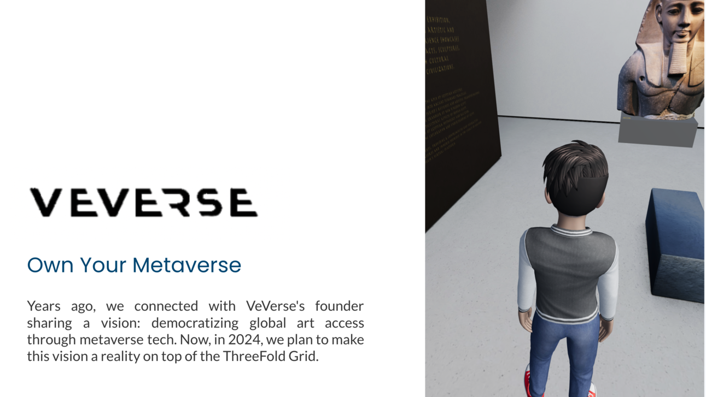
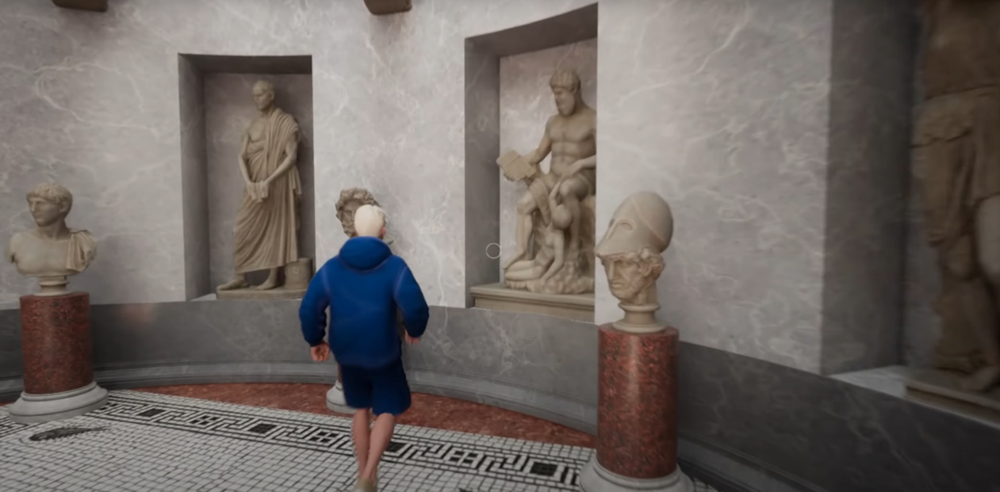

## Vverse: Virtual Universe Explained

[Vverse](https://www.vverse.io/) is an innovative platform that aims to create a virtual universe where users can explore, interact, and create in immersive virtual environments. It leverages cutting-edge technologies such as virtual reality (VR), augmented reality (AR), and blockchain to provide users with a seamless and engaging experience.

**Key Features of Vverse:**
- **Immersive Environments:** Vverse offers a variety of immersive virtual environments for users to explore, ranging from futuristic cities to fantastical landscapes.
- **Social Interaction:** Users can interact with each other in real-time within the virtual universe, fostering a sense of community and collaboration.
- **Content Creation:** Vverse provides tools and resources for users to create and customize their own virtual experiences, from designing virtual spaces to programming interactive elements.
- **Blockchain Integration:** The platform utilizes blockchain technology to ensure security, transparency, and ownership of virtual assets within the Vverse ecosystem.

**Future Partnership: Hosting with ThreeFold**

In the future, Vverse aims to partner with ThreeFold to leverage its decentralized cloud computing platform for hosting its virtual universe. By utilizing ThreeFold's infrastructure, Vverse can benefit from increased scalability, reliability, and data sovereignty for its platform. 

**How ThreeFold Can Support Vverse:**
1. **Scalability:** ThreeFold's decentralized cloud computing platform can accommodate the growing demands of Vverse's user base and content creation tools.
2. **Reliability:** With ThreeFold's distributed architecture, Vverse can ensure high availability and uptime for its virtual universe, minimizing downtime and disruptions.
3. **Data Sovereignty:** By hosting on ThreeFold, Vverse can maintain control and ownership of its data, ensuring privacy and security for its users' virtual assets and interactions.

**Conclusion:**
Vverse represents the future of immersive virtual experiences, and partnering with ThreeFold for hosting services aligns with its commitment to providing users with a secure, scalable, and decentralized platform. Together, Vverse and ThreeFold can create a virtual universe that pushes the boundaries of innovation and fosters creativity and collaboration on a global scale.

For more information about Vverse, visit [vverse.io](https://www.vverse.io/).

> [Example of a VVerse Museum](https://youtu.be/FCjofnZnTDk)

 [https://artheon3d.veverse.com/](https://artheon3d.veverse.com/)
