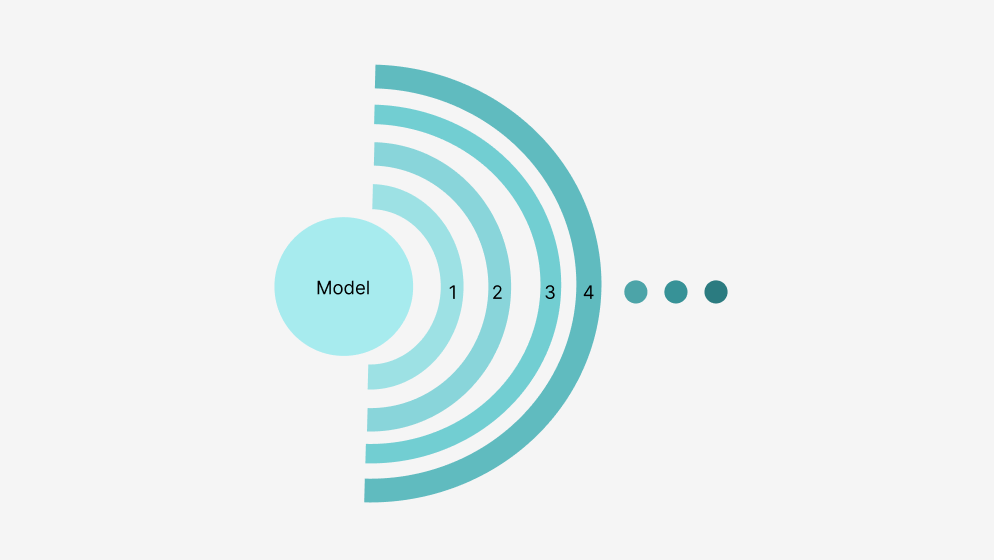

  

# Painkillers are not a solution.

Currently, most develop their digital future by implementing many independent projects which all act as painkillers to their problems. While a painkiller might fix symptoms, it rarely solves the root issue. This happens for content providers, countries, enterprises.

We should stop treating the symptoms it becomes time to resolve the root cause.

We believe you have the opportunity to leapfrog straight to a solution which is both easier to implement and solves most of its issues all at once.

This has huge benefits:

* It's much more cost effective
* It's easier and more integrated which results in many benefits for the users
* It will be safer (think about the cyber pandemic happening right now)
* It is more prepared for the future
* It's greener (such a system will use up to 100 times less energy)

## onion layers

  

What has IT to do with onions...

The development of applications in the IT sphere has been using painkiller methods at each layer of model first patterns to go forward. 

## Model First Pattern

A model first pattern has a standardised foundation. When there is a problem or a bug, or when changes are required, it is not possble to change the sublayers, so a new layer is created. Making changes in the middle is affecting everyhting else that is on top, therefore, it requires more work. Layers keep being added on top of the base which adds complexity, si the problem is never fixed at the root. 

The model can be seen as a dictionary that keeps on expanding more and more. 
- More but complex words = Harder to understand
- Less but simple words = Easy to understand

Now, imagine when hundreds of such models are connectted to one another and exchanging information. The more layers each indivdual model has, the heavier it is for its message to get across. The whole system becomes very complex. 

The problem here is that individual systems are trying to redo things better, however they are using the same base infrastructure. They simply redefine that base towards a relevant issue. Ths cannot lead to optimal systems since solutions are managed around a single functiion. If multiiple people need to use that function it gets very complicated. 

One way to go around this has been to use Enterprise Message Bus: Controlling how models talk to each other by pre-defining the messages exchanged. But this does not solve the problem at the root.

