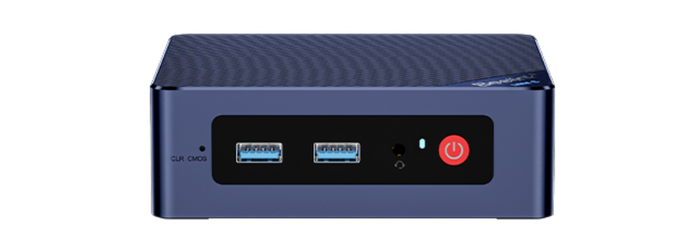
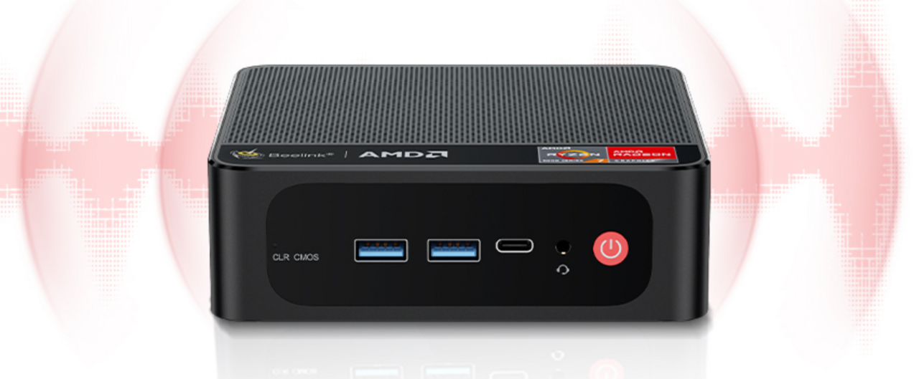
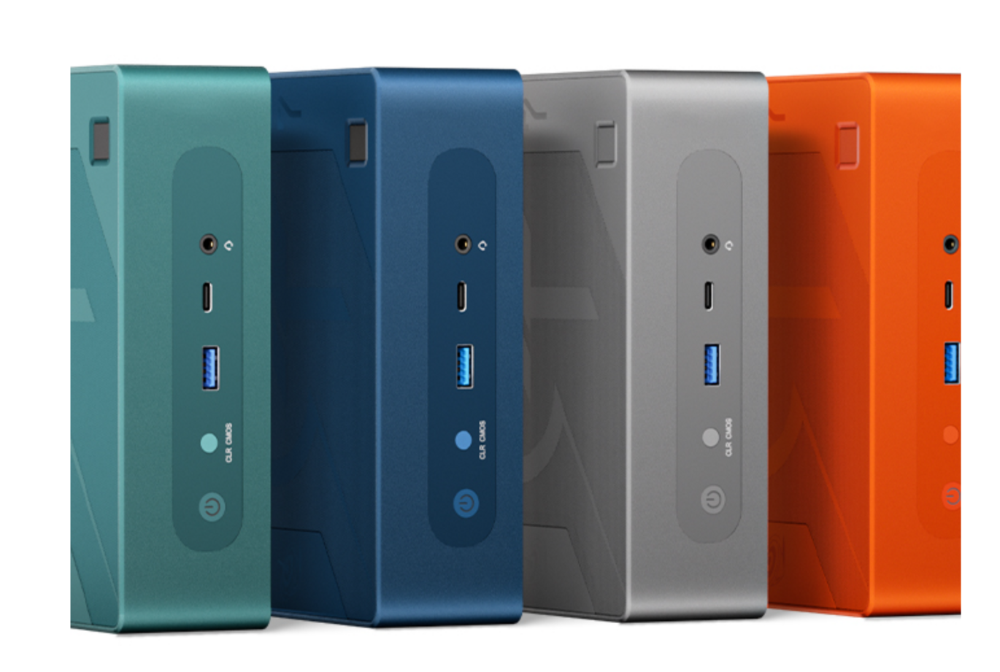

# Available TFNodes

> TODO: explain we can create nodes ourselves

### TFNode Silver

- 16 GB Memory
- 512 GB SSD
- min 4 logical CPU cores

Will cost less than 500 USD.

### TFNode Gold

- 32 GB Memory
- 1000 GB SSD
- min 8 logical CPU cores

Will cost less than 1000 USD.

### TFNode Platinum

- 64 GB Memory
- 2000 GB SSD
- 4000 GB HDD
- min 16 logical CPU cores

Will cost less than 1800 USD.

### TFNode Datacenter

- put your own TFNode in a datacenter of choice, make sure you have great and cost effective reliable connectivity to internet.
- The Farmer buys their own hardware, ThreeFold supports the farmer to get up and running.

### TFNode Dedicated Rental

- rent a node in a dacenter, make sure you have good capacity in that datacenter. Companies like OVH and Hetzner come to mind as reliable and cost effective.

## Remarks

We are still working on the exact logistics, the look and feel can be different, but minimal resources will be the same.
