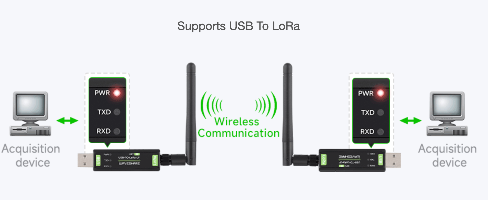

## TFRouters

The TFRouters allow everyone to connect the users of our network with the *TFNODE

### TFRouter Indoor

We are partnering with WiFi device vendors to extend the Mycelium Network in a full peer-to-peer fashion.

WiFi 6 is now a reality and a native capacity from our first chosen node. The TFRouter Indoor can be purchased starting now. 

It's an exciting node with a reasonable price point and enough CPU capacity to run the Mycelium Network stack within the node itself.

More than 1 node can be installed in a larger office, hotel, home, etc., and they will automatically mesh together.

Each node runs our *ZNET Operating System, allowing for native integration into the TFGrid network.

[Zero-OS](def:zos) Nodes are seamlessly integrated with the Zero-Net nodes by design, requiring minimal configuration. They are part of our Autonomous Zero-OS Stack.

### TFRouter Edge

The TFRouter Edge is a powerhouse, equipped with a strong CPU and lots of memory to run edge network functions. This router can be connected to multiple uplinks (satellite, cable, fiber, 5G), ...

Mycelium ensures that the shortest and fastest path is always used, and all communication is end-to-end encrypted between an TFRouter or even your mobile or computer if you have the Mycelium agent installed.

The integrated antennas are powerful, with a long range, and are controlled independently. The Zero-Net Software manages the accounting and mutual credit billing system.

This TFRouter is super fast and has lots of connectivity.

> This TFRouter can be bought right now.

### TFRouter Outdoor + Long Range

We are in the process of selecting the appropriate network equipment to bridge between two locations and enable the creation of meshed wireless networks at the lowest cost.

Currently, we rely on fiber or existing internet connections to link between locations, but wouldn't it be cool if we could create our own long-range network connections?

> We are looking for volunteers who will be rewarded to do reasearch and experiment with chosen equipment to test performance in real life situations, let us know if interest to help.

## Lo-RAN

!!task.add story:'TFRouter_selection' title:'describe loran on TFRouter'