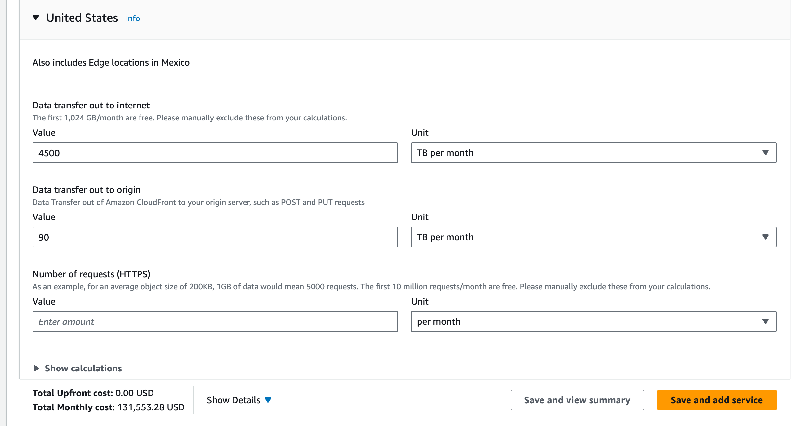
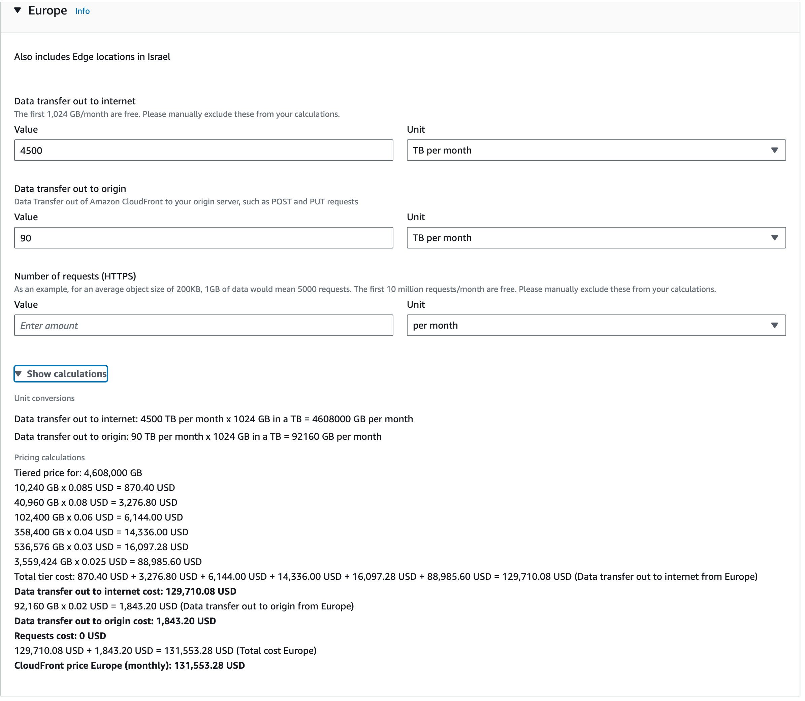
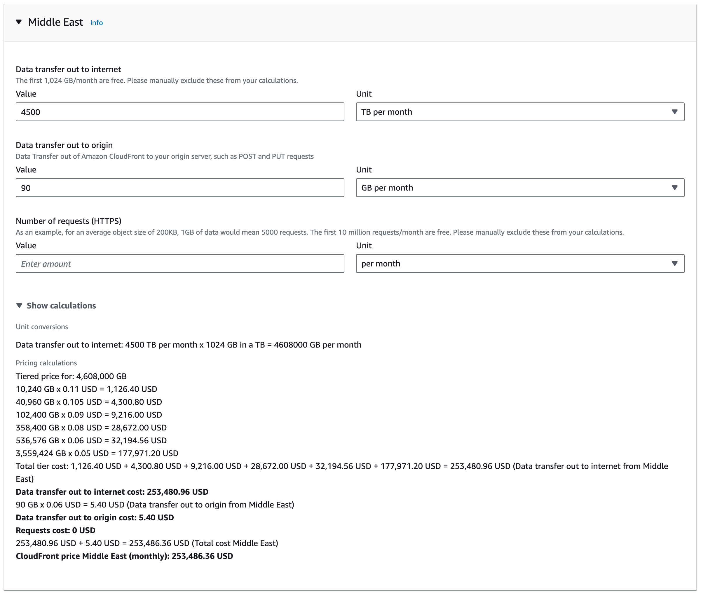
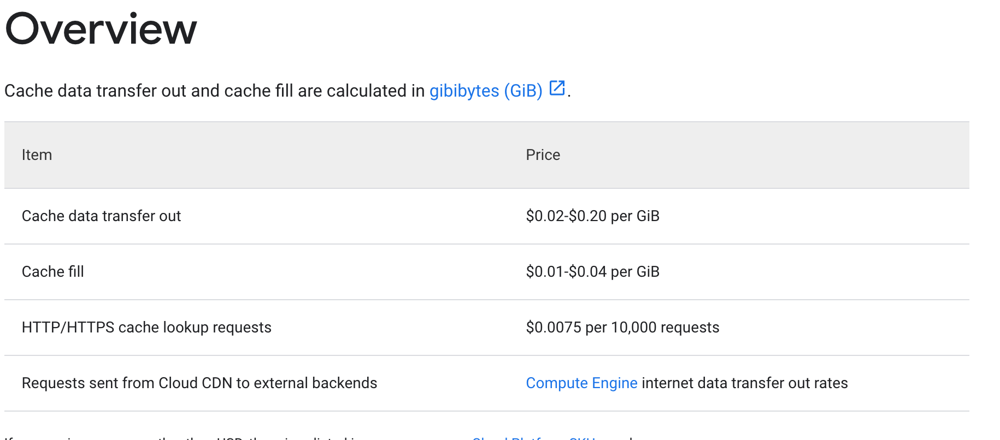
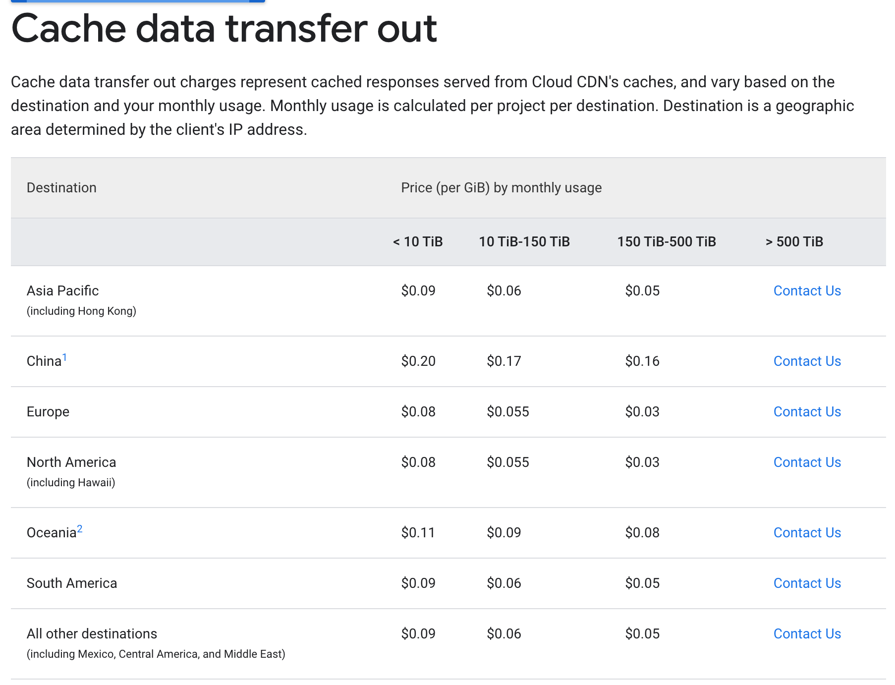

## high CDN cost = Content Delivery

- CDN's cost between 20 and 60 on major CDN's from Amazon, Google, ..., after negotiation and willingness to park lots of money and commit per month it mught be certain discount.
- Other specialized CDN's can be around 10 per TB if services from e.g. Europe or US, smaller CDN's are much more expensive.
- Managing these CDN's is expensive and not easy job.

>> this means to service 10m people it would cost about 1 to 2m USD per month just for CDN alone.

# CDN pricing Amazon

Remark no fees included for HTTPS requests, but should be ok for volume we are talking about, if app is made in right way.

## US

= 28 USD per TB in US

## EUR

## MIDDLE EAST

= 56 USD per TB

## AFRICA

= 56 USD per TB

## Discounts

- discounts can be negotiated but required serious amounts of pre-financing

# CDN pricing Google

Remark no fees included for HTTPS requests, but should be ok for volume we are talking about, if app is made in right way.

https://cloud.google.com/cdn/pricing

