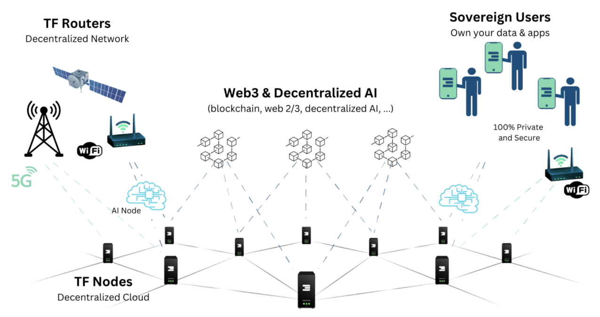

## Architecture

### TF Nodes (or 3Nodes)

The network of nodes which make up the cloud, each node provides compute, storage and network capacity.

### TF Routers

With the introduction of new devices in TFGrid 4.0, anyone can now operate as a network service provider.

TF Routers seamlessly integrate with our Mycelium network technology, efficiently selecting the shortest path between all participants.

These TF Routers are not only compatible with Wi-Fi but also with 4G and 5G networks, ensuring versatile connectivity options.

### Web3 & Decentralized AI Compatibility

The TFGrid is the ideal platform for hosting any Web3 and AI workloads. Our Zero-OS operating system already supports integrated GPUs, ensuring optimal performance for decentralized AI applications.

> Any workload (web2/3 and AI) can run on TFGrid.