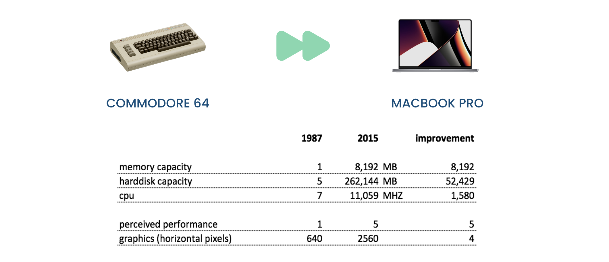

## we forgot to use hardware well

The IT world fails to harness the full potential of computer hardware.

While hardware advancements have surged forward, user experiences and features have often stagnated, failing to keep pace with these developments.

The original Commodore 64, with only 64 KB of memory, was a remarkably capable machine for its time. In contrast, today's computers boast 8 GB or more of memory, yet their capabilities have not necessarily improved proportionately.

This highlights a regression in our ability to fully utilize computer hardware.

At Threefold, we are committed to bridging this gap by optimizing our approach to hardware utilization, thereby unlocking its full potential.