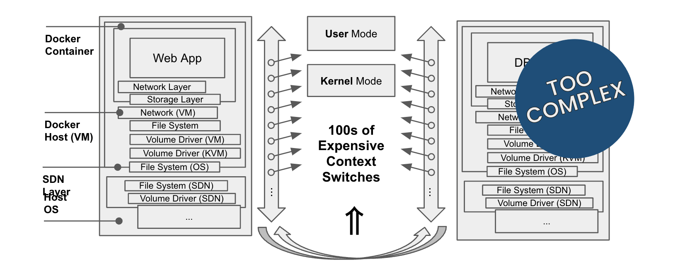
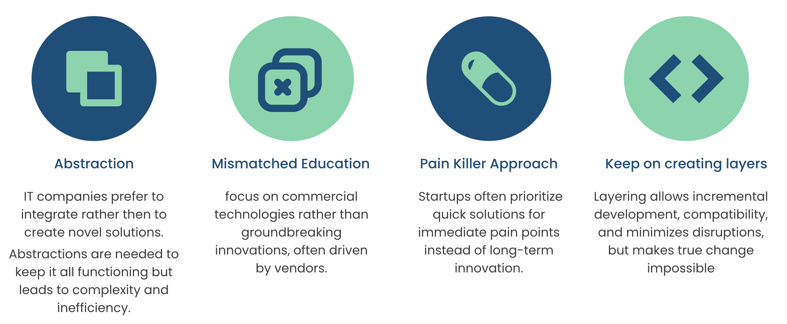

# Layers

Too many abstraction layers results in bad efficiency, performance loss, increased management costs, and scalability challenges.

This is due to a number of reasons.

In the context of CPU scheduling in Linux (and in most modern operating systems), a context switch refers to the process of saving the state of a currently running process (such as its registers, program counter, and other relevant information) and loading the state of a different process to allow it to run. This switching of execution from one process to another is a fundamental aspect of multitasking operating systems, where multiple processes share the CPU's time.

Here's how a context switch typically works in Linux:

1. **Interrupt Handling**: When a higher-priority process needs to run or an event requiring immediate attention occurs (such as I/O completion), the CPU interrupts the currently running process.

2. **Saving Context**: The operating system saves the state of the current process, including its registers, program counter, and other relevant data, into its process control block (PCB). This step ensures that when the process resumes execution later, it can continue from where it left off.

3. **Scheduling Decision**: The operating system scheduler determines which process should run next based on scheduling algorithms and the priority of processes in the system.

4. **Loading Context**: The operating system loads the state of the selected process from its PCB into the CPU, allowing it to execute. This includes restoring the process's registers, program counter, and other relevant data.

5. **Execution**: The newly loaded process begins executing on the CPU.

Context switches are essential for multitasking, but they come with overhead that can impact system performance:

1. **Time Overhead**: Context switches require time to save and restore process states, as well as to perform scheduling decisions. This overhead adds up, especially in systems with many processes frequently switching contexts.

2. **Cache Invalidation**: Each time a process is switched in, it may result in cache invalidation, where the CPU's cache needs to be refreshed with data from the new process's memory space. This can lead to cache misses and performance degradation.

3. **Resource Contentions**: Context switches can exacerbate resource contention issues, especially in systems with limited CPU cores. If multiple processes are frequently contending for CPU time, the overhead of context switches can further delay process execution.

4. **Fragmentation**: Frequent context switches can lead to memory fragmentation, as processes are loaded and unloaded into memory. This fragmentation can degrade system performance over time, as it becomes more challenging to find contiguous blocks of memory for new processes.

While context switches are necessary for multitasking, excessive context switching can indeed lead to a significant loss of execution power by introducing overhead and resource contention in the system. 

Therefore, efficient scheduling algorithms and optimization techniques are crucial for minimizing the impact of context switches on system performance.