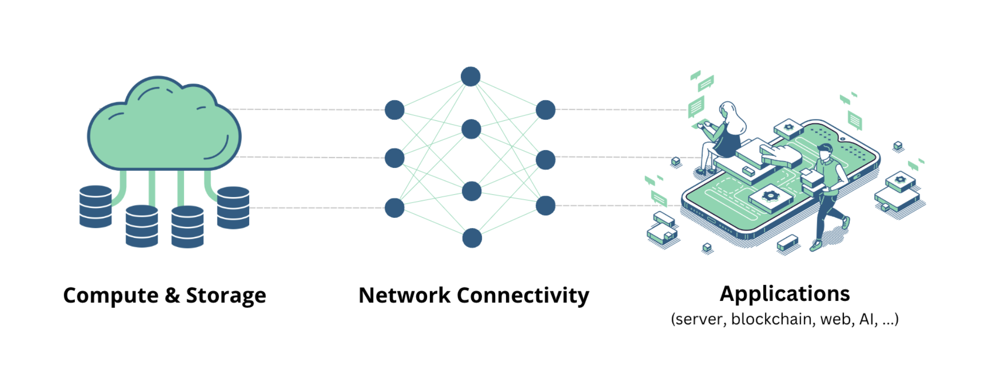
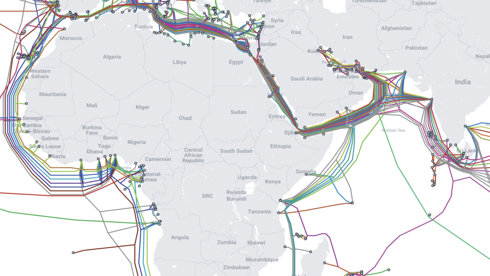
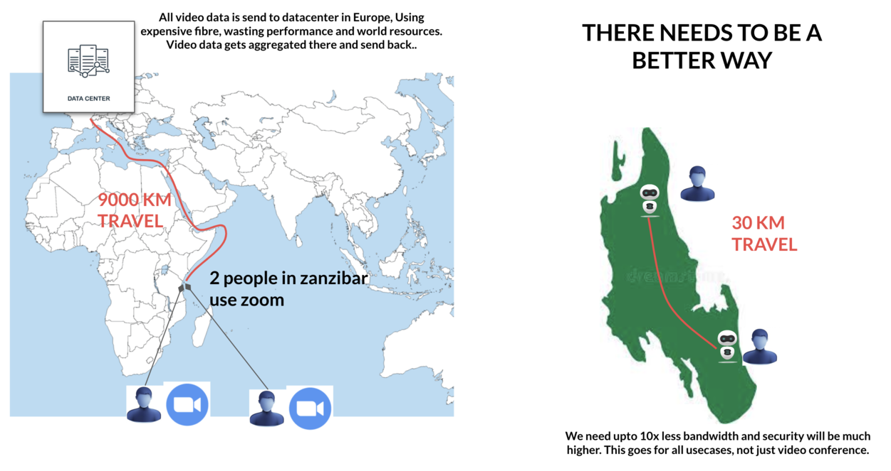
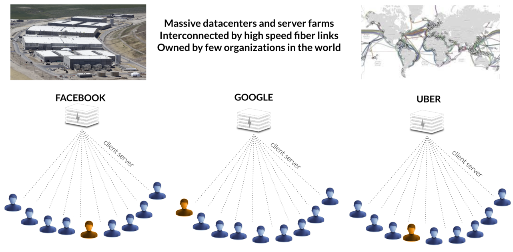

# The Internet Is Broken

**THE THREE LAYERS OF THE INTERNET**

The Internet is made up out of 3 layers

- compute, storage: this is where the applications are being served from
  - today: highly centralized and running from large datacenters (see below)
- network: ability for information to travel
  - can be as wireless, cables (fiber) and satelite links, ...
  - right now the information needs to travel very far, for most countries there is few local information
  - very few companies own +80% of the network capacity
- applications:
  - today hosted in huge datacenters using the compute and storage capacity as provided
  - too centralized and because of that also vulnerable

The information travels mainly over large fiber backbone links.

The Internet as we know it is far away from the original intent, if 2 people in e.g. Zanzibar (an Island in Africa) use Zoom with each other then the information will travel to Europe in a large datacenter where the Zoom servers are being hosted.

This leads to very inneficient behavior, slower performance, less reliability and a cost which is higher than what it should be.

We became products.

- All our data is hosted in large datacenters owned by few large corporations.
- We exist many times, and each time a full infrastructure has been built to deliver the applications from.

