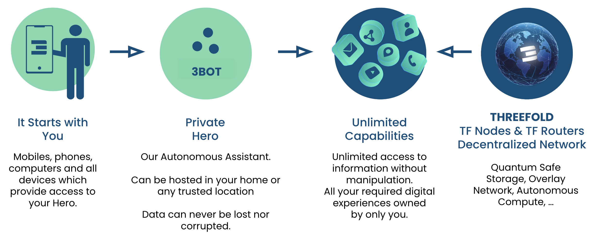
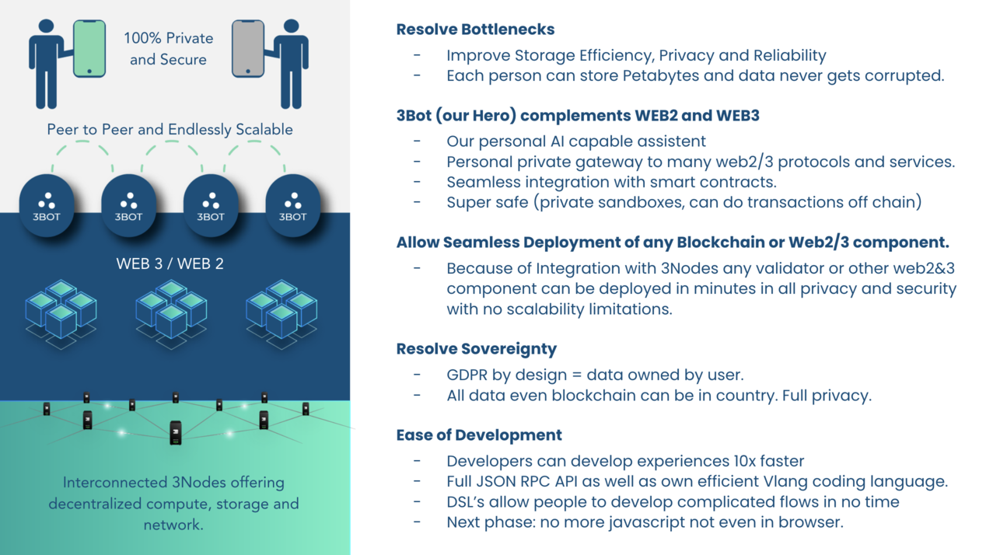

#  The Internet’s Natural Progression

The Internet was always meant to be a peer-to-peer infrastructure.   As large companies became profit and data centric, centralization quickly became the norm.

> We have a vision of the Internet which is much more close to how the Internet was intended to be.

We believe in a world where every person is the center of his/her digital life.  In this new Internet each person has his/her own digital avatar which we call a hero. 

The technical component which makes hero possible is a compoment called 3bot. This 3Bot server is only owned and managed by you lives on top of the ThreeFold Cloud.

All the 3Bots communicate to each other over the shortest possible path, this path is end2end encrypted.

The underlying network of capacity is the ThreeFold Cloud which is the IT Energy which makes all possible.

The ThreeFold Cloud is the result of more than 10 years of development and now active on more than 2000 nodes.

## Requirements For A New Internet

- Compute, Storage, Network need to be
  - Local
  - Sovereign
  - Private
  - More Secure
- Storage needs to be
  - More reliable with less overhead (only 20% overhead needed)
  - Capable to be global and be used as CDN (Content Delivery Network)
  - Fast enough for the Use Case at hand
- Network needs to be
  - Working no matter what happens with existing network, route around issues.
  - Local sensitive (chose shortest path)
  - End2End Encrypted
  - Capable to really know where information goes to or comes from (authenticity)