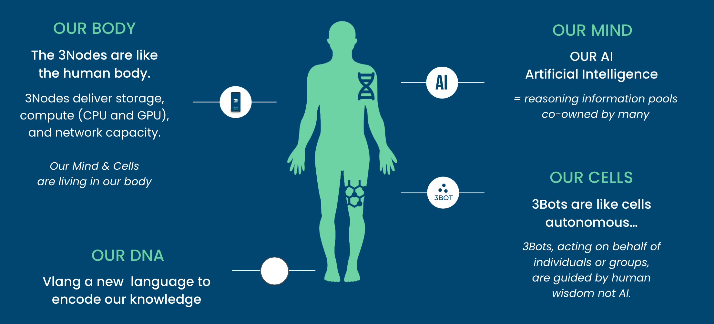
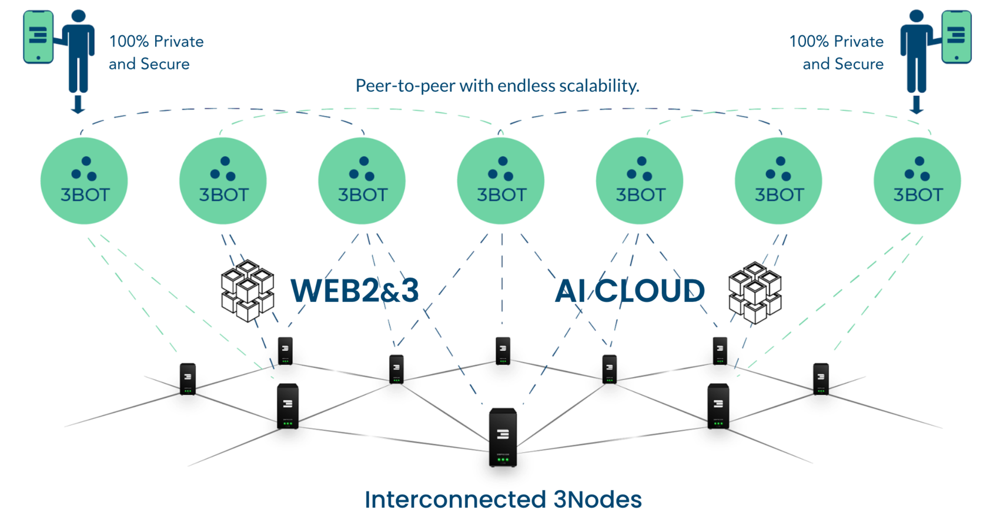

# ThreeFold grid inspired by nature

- Just like we have trillions of cells in our body, so can billions of twins live next to each other
- Each twin has memory, knows how to communicate, has knowledge, history, ...
- Twins like cells cannot live without a body = TFGrid.

## This approach scales for ever

- There can be unlimited amounts 3Nodes and 3Bots (Digital Twins)
- There are no bottlenecks nor centralization points
- Our peer2peer network technology takes care of routing and security issues between the Twins and the TFNodes (3Nodes). The shortest paths is always looked for.

