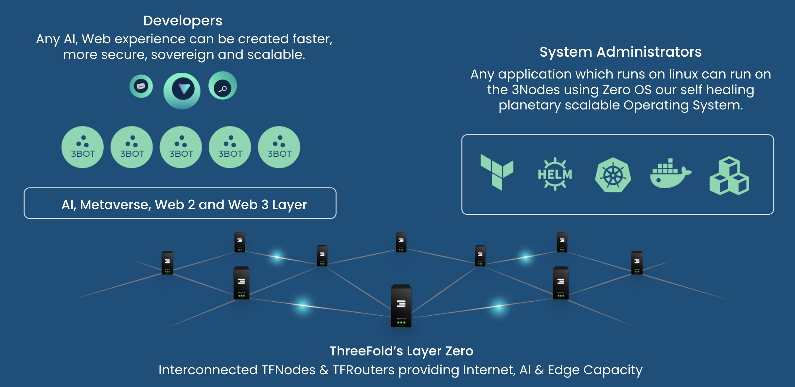

#  ThreeFold Infrastructure Layer

ThreeFold has developed a highly efficient infrastructure layer with 3 layers:

- compute - a flexible way to deploy any workload on edge cloud computers
- storage - a quantum safe storage system
- network - a planetary scalable overlay network

ThreeFold nodes provide Internet (storage, compute and network) to the people around.

## Developers Platform

There are multiple ways how people can interactive without our platform (as developer or IT expert = sysadmin):

  

