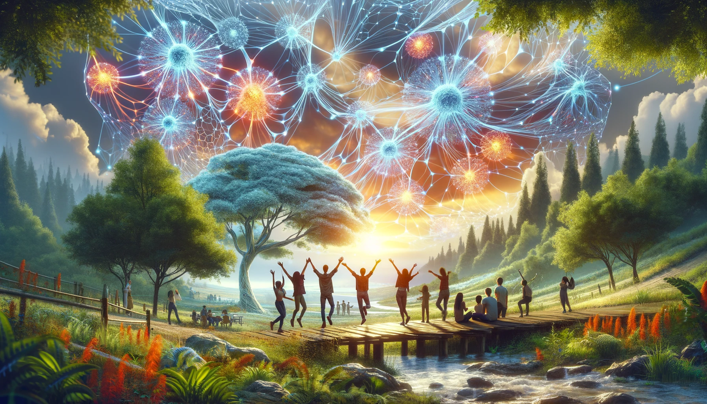

# Governance

Governance is important to us, there is a wish from TF DMCC to outsource the operations and promotion to a cooperative and the community for which we suggest a combination of GEP, Guardians and a Cooperative

## Planned for 3.14 (our next release)

- GEP process = voting process on TFChain (the ThreeFold Blockchain)
- 9 guardians: run the validators and necessary tooling for the TFGrid
- 9 cooperative directors (at start are cooperative founders): create a cooperative for all members

## Treasury

