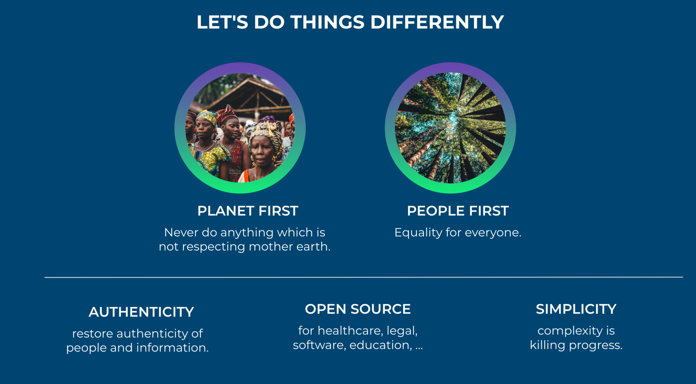

We want to be at the forefront of a growing movement, more and more organizations are being pushed by their stakeholders to prioritize sustainability and planet positive policies. 

We are not swimming against the stream, we are part of a group of leaders of change and making real the zeitgeist of the 21st century. 

## Core Values

Anything we do needs to improve our planet's situation (climate change, regenerative, respect resources, …) and help the people around us. 

As a result of doing so, we as investors of time and money will have created most value and will get the benefits from our efforts.

## Tools

There are some practical tools which help us to achieve above values.

## OpenSource

OpenSource has been an incredible tool for us, it allowed us to grow and even exit more than 7 companies.

Open-source software offers transparency, allowing for enhanced security. It fosters innovation and rapid development by leveraging global contributions. The collaborative nature reduces costs and accelerates problem-solving

## Simplicity

Our motto is that achieving fewer lines of code at the end of the month compared to the start signifies an amazing job, a challenging job for a software development company.

By focusing on simplicity, developers can create more reliable, efficient, and sustainable software solutions that meet users' needs more effectively, leading to greater success and longevity of the software in the dynamic tech landscape.

## Authenticity

We dream of a future where all information is true and everyone can fully trust each other. In this place, knowing that the facts are right and the messages are honest helps people and groups work better together. They can share openly and trust what others say. This trust makes everyone feel more connected and confident. We're working hard to make technology that keeps information safe and real, helping to build a world where trust is a given.