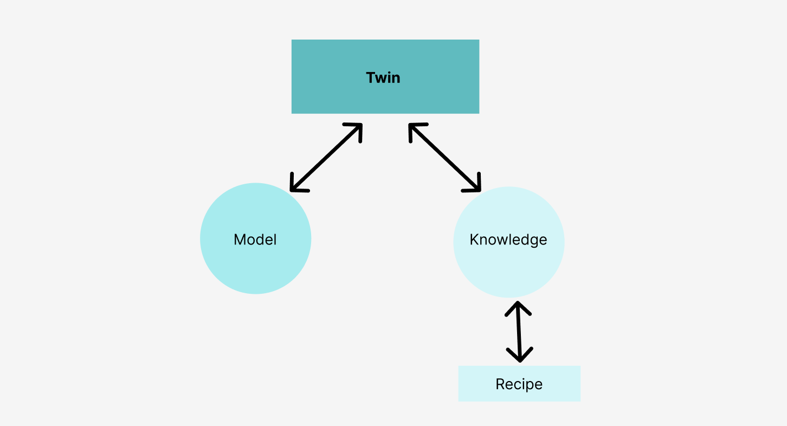

## OurDigital Self Actor Driven Approach

'actor' driven pattern instead of a model first pattern. 

In such a pattern, the root model only holds essentials in its database, hence any necessary changes can be applied at the root. 

The model can tap direct into knowledge (how to do certain things) by accessing the 'recipes'. 'Recipes' are the source code that can easily be adapted to any task. By using Domain Specific Language (DSL) it is easy to reuse recipes. 

> TODO: too dense, need more explanation

