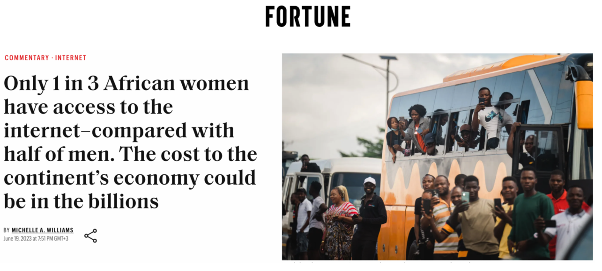
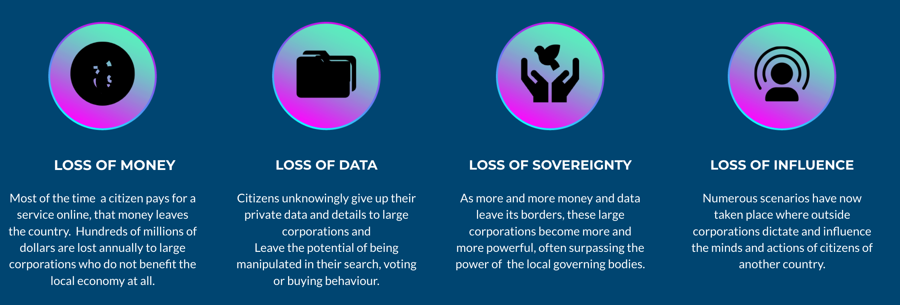

# Many Countries Do Not Have Their Own Internet

The issue extends beyond countries lacking their own Internet infrastructure; a significant portion of the global population still lacks access to the Internet.

It is a must to democratize the Internet.

## IMMENSE LOSSES

**BECAUSE OF THE CENTRALIZED MODEL**

some companies have access to the data of hundreds 
of millions of citizens, this makes us a product.

